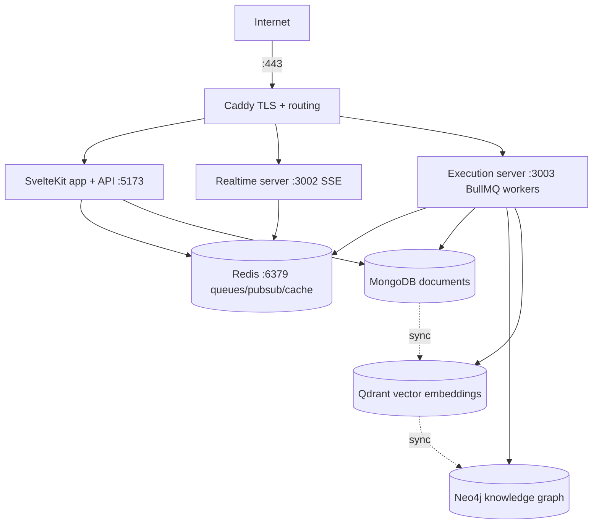
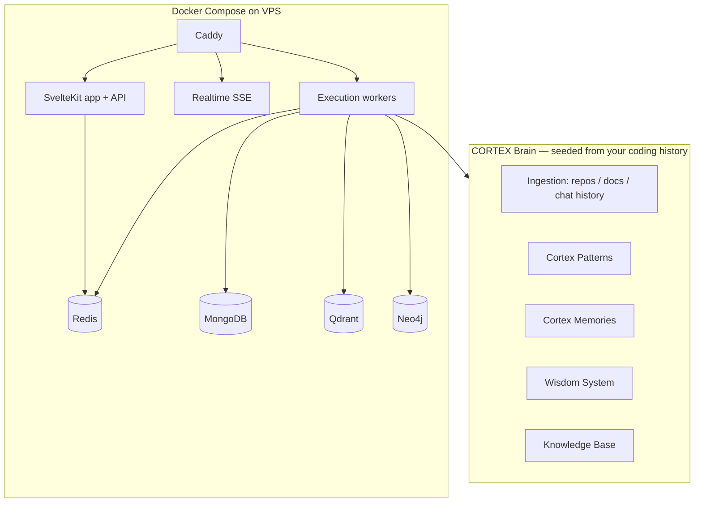

# Regno Architect Rebuild Plan

> **Goal:** Stand up a fresh, self-hosted "Regno Architect Me" — a working Regno-style platform with a
> CORTEX brain seeded from your personal coding history — hosted on a VPS, built primarily from the
> documentation pulled into `docs/` plus targeted reconstruction.
>
> **Source of truth:** `docs/` (331 files pulled from regno.ai, 2026-08-27) + live platform survey.
> **Excluded from source docs:** CMS category (28 docs) and CMS-labeled root files, per instruction.

---

## 1. Verdict — can the whole system be rebuilt from the docs alone?

**Mostly yes for the core platform; no for a bit-for-bit clone.**

The docs are unusually complete. They contain:

- Full production topology and a step-by-step `deploy.md`
- Documented database schemas (MongoDB collections, Qdrant collections, Neo4j graph, Redis/BullMQ)
- The complete Cortex Flow agentic engine design (the reasoning layer)
- CORTEX memory/intelligence system architecture
- Queue system (BullMQ), realtime SSE server, logging, streaming, event system
- API route inventory and auth audit (`references/route-auth-audit.md`)
- UI component inventory and refactor notes

What the docs do **not** contain:

- The actual source code (654+ Svelte components, all `src/lib/server/**` services, workers, prompts,
  seed scripts, migrations)
- Exact schemas for the proprietary/business data (CMS `smartdcc` data, 30-role taxonomy, etc.)
- Binary/config secrets and API keys

**Implication:** You can rebuild a faithful, functional Regno platform using the docs as the
authoritative blueprint — especially the **CORTEX brain + Cortex Flow reasoning layer + the
three-store data layer (MongoDB/Qdrant/Neo4j/Redis)**. Recreating the full CMS/proprietary app 1:1
would require the source or a long, low-value reimplementation.

**Recommendation:** Make "Regno Architect Me" the north star (an app-building brain personalized to
your coding history). Rebuild the *architect engine*, not the whole CMS.

---

## 2. What regno.ai actually is (from docs + live system)

### 2.1 Production topology (from `docs/references/deploy.md`)



### 2.2 Live CORTEX architecture (observed on regno.ai/cortex, all online)

```
Data Sources (Ingestion · Watched Dirs · Connectors · SDK)
   └─► Vector DB (Qdrant) · Graph DB (Neo4j) · Document DB (MongoDB, 16 collections) · Embedding (LLM)
          └─► Cortex Flow — Reasoning Layer (Agents · Tools · Orchestration · Quality Loop · Wisdom)
                 └─► Redis (cache/pubsub/queue backing) · BullMQ (18 queues · 18 workers)
```

### 2.3 Cortex Flow engine flow (from `docs/cortex-flow-design.md`)

```
POST prompt → SvelteKit route (NO inference here) → enqueue BullMQ('orchestrate')
  → Execution server → Orchestrator
      1. PlanEngine.generate → (agent, topology) via agentRouter (confidence ≥0.7)
      2. Per phase: ToolRegistry.configureFromSettings + ContextBuilder injects needs
         → turn-loop (Read, Grep, KnowledgeBase, DataSourceQuery, PythonExec, ...)
      3. Final phase → Orchestrator.runRefineLoop (QualityAuditor grades → critique → regenerate)
      4. Persist artifacts + [WISDOM] insights → AgentMemoryService (compounds over time)
  → Realtime server streams v2_agent_routing, phase progress, tokens, result
```

---

## 3. Database inventory (the "graph, vector, mongo and all other databases")

### 3.1 MongoDB — primary document store (16+ collections on live)

| Collection | Purpose | Key fields (from docs) |
|---|---|---|
| `users` | Accounts + RBAC | email, passwordHash, role, apiKeys, preferences |
| `roles` | Role taxonomy | role, privileges |
| `credentials` | Encrypted API keys (AES-256-GCM) | type, name, encryptedValue, provider |
| `system_config` | Platform settings / tiers | tier, settings |
| `cortex` | Per-user CORTEX config | user, config |
| `cortex_agents` | Agent definitions | slug, name, phases, tools, triggers, costCeiling |
| `cortex_patterns` | Proven patterns (source of truth) | name, description, tags, confidence |
| `cortex_memories` | Execution memories / insights | taskId, insights, contexts |
| `cortex_checkpoints` | Session checkpoints (24h) | sessionId, state |
| `cortex_executions` | Execution logs | taskId, agentSlug, phases, cost, duration, status |
| `cortex_agent_memories` | Operational wisdom (compounding) | agentSlug, category, content, contexts, relevanceScore |
| `cortex_index` | Indexed knowledge pages | url, title, content, domain, relevanceScore, qualityTier |
| `cortex_knowledge_facts` | Atomic extracted facts | domain, content, confidence, entities, _relevanceScore |
| `cortex_entities` | Named entities | name, domain, mentionCount, type |
| `cortex_domain_experts` | Compiled domain expertise | domain, version, artifact, completenessScore |
| `cortex_domain_analysis` | Domain grading | domain, analysis.grade, summary, factCount |
| `knowledge_staging` | Pipeline staging | domain, sourceUrl, status |
| `knowledge_seed_status` | Crawl/ingestion tracking | url, status, crawledAt, indexedAt |
| `prompt_versions` | Prompt versioning + metrics | version, content, metrics |
| `skills` | Skill definitions | slug, name, definition |
| `pipelines` / `pipeline_history` | FLUX pipeline defs + history | definition, metadata, history |
| `staged_projects` / `staged_project_states` | STAGE orchestration state | phases, state |
| `maestro_events` / `maestro_validations` | MAESTRO workflow events | processId, event |
| `audit` (time-series) | Compliance audit log | actor, action, controls, seal |
| `associations` | user/role/app/privilege links | user, privilege, app, role |
| `companies` | CMS/business data | metadata, serviceProviders |
| `_history` | Permanent doc history | snapshots, versions |
| `vision_narrations` | Vision narration audio/state | narration, script |
| `cms_process_runs` | CMS process runs | one doc per run, embedded steps |

### 3.2 Qdrant — vector store (documented in `architecture/REGNO_AI_ARCHITECTURE_2026.html` §3.2)

| Collection | Embedding model | Metric | Purpose |
|---|---|---|---|
| `cortex_patterns` | OpenAI text-embedding-3-small | Cosine | Semantic pattern retrieval |
| `cortex_wisdom` | OpenAI text-embedding-3-small | Cosine | Agent memories, near-dup merge, conflict detection |
| `cortex_execution_memories` | — | — | Execution memories (from `LEARNING_KNOWLEDGE_BASE_ANALYSIS.md`) |
| `knowledge_vectors` | — | — | Knowledge facts vectors |
| `doc_search` | — | — | Ask-the-docs RAG (`docs-route-unified.md`) |

### 3.3 Neo4j — knowledge graph

- Pattern relationship traversal (semantic → graph)
- `(:AuditUser)-[...]->` lineage graph for audit (governance/audit)
- Entity graph from knowledge ingestion (`cortex_entities` → nodes, relationships)
- APOC plugin required (deploy.md)

### 3.4 Redis + BullMQ — async substrate

- BullMQ: **18 queues / 18 workers** (live) — orchestrate, doc-author, cms-*, sealDaemon, etc.
- Redis: pub/sub for cross-process cache invalidation + SSE event bus, cache, priority queues
- Sub-100ms pickup via `drainDelay: 0` on critical queues

### 3.5 Other data layers referenced

- **PostgreSQL** — exists (`/api/admin/monitoring/test-postgres`, `AI_FIRST_REASONING` source types)
- **DynamoDB** — external credential type supported
- **GridFS** — file/blob storage (audio, images) inside MongoDB
- **LLM providers** — Anthropic, OpenAI, Google AI (multi-provider gateway)

### 3.6 Three-store sync (documented §3.3)

Pattern write flow: **MongoDB (primary) → Qdrant (embedding) → Neo4j (graph node)** — eventual, seconds.

---

## 4. What's missing and how to fill it

| Gap | How to fill |
|---|---|
| Actual source code of services/UI | Reconstruct from docs + implement; docs name file paths (`src/lib/server/cortex/QdrantService.ts`, etc.) so structure is known |
| Exact DB migrations / seed scripts | Reconstruct from collection schemas in §3; docs name seed scripts (`scripts/*.cjs`) |
| LLM prompts | Reconstruct from `DSPY_PROMPT_OPTIMIZATION.md`, `SKILLS_ARCHITECTURE.md`, `cortex-flow-design.md` |
| Proprietary CMS business data | **Skip** (out of scope) |
| Production secrets / API keys | You provide; stored in `.env.prod` |

---

## 5. Target: "Regno Architect Me" architecture

A leaner build that keeps the engine, drops the CMS surface:



**The brain is the moat:** ingest your personal coding history (this `regno-ai` repo, past repos, commit
history, coding sessions) → CORTEX ingests into Mongo/Qdrant/Neo4j → Cortex Flow agents retrieve
patterns + wisdom on every build task → the system gets faster at building *your* kind of apps.

---

## 6. Phased roadmap

### Phase 0 — Foundation & schema (this repo)
- [ ] Produce a `docs/DB_SCHEMA.md` consolidating every collection/field found in the docs
- [ ] Scaffold the fresh project: `apps/web`, `apps/execution`, `apps/realtime`, `packages/`
- [ ] Write `docker-compose.yml` for Mongo 7 / Qdrant 1.7+ / Neo4j 5 (APOC) / Redis 7

### Phase 1 — Data layer
- [ ] Mongo connection manager (pooled, capped, idle-evicted — per `REGNO-MONGO-CONN-MANAGER`)
- [ ] Qdrant service (`QdrantService`) + `text-embedding-3-small` embedding pipeline
- [ ] Neo4j service (`Neo4jService`) + three-store sync (pattern write flow)
- [ ] Redis pub/sub + cache invalidation bus

### Phase 2 — CORTEX Brain
- [ ] Knowledge ingestion pipeline (crawl → facts → entities → domain experts)
- [ ] Patterns system (store + semantic + graph)
- [ ] Agent memories + WisdomSynthesizer (compounding loop)
- [ ] Ask-the-docs RAG (`doc_search`) over `docs/`

### Phase 3 — Cortex Flow reasoning layer
- [ ] `cortex_agents` + agent router (`general-assistant` default)
- [ ] ToolRegistry (Read, Grep, KnowledgeBase, DataSourceQuery, PythonExec, WebSearch)
- [ ] Orchestrator + PlanEngine (`analysisDepth`: quick/standard/deep)
- [ ] QualityAuditor + refine loop (rubric grading)
- [ ] BullMQ queues/workers + SSE realtime streaming

### Phase 4 — Seed "Regno Architect Me"
- [ ] Personal-history ingestion: this repo, past repos, git history, coding sessions
- [ ] Train patterns + wisdom from your actual build style
- [ ] Define a `regno-architect` agent with your conventions in its phase prompts

### Phase 5 — Hosting (VPS)
- [x] **Server selected: OVHcloud eco SYS-GAME-1** — AMD Ryzen 5 3600X (6c/12t @ 4.4GHz), 64GB RAM, 2×512GB SSD, 500Mbps, Ubuntu 24.04, £53.39/mo incl. VAT
- [ ] Provision server + install Docker Engine 24+ & Docker Compose v2
- [ ] `deploy.md` mirror: Caddy TLS + 3 images + Redis, external Mongo/Qdrant/Neo4j
- [ ] `.env.prod` with your API keys (Anthropic/OpenAI/Google), JWT secret
- [ ] Backups + monitoring (audit seal, logging from `infrastructure/` docs)

---

## 7. Decisions

1. **Scope** — **Engine-first** (CORTEX brain + Cortex Flow reasoning layer + data layer + minimal web UI). MAESTRO / STAGE / Canvas / charts added later.
2. **VPS provider** — **OVHcloud eco SYS-GAME-1** (AMD Ryzen 5 3600X · 6c/12t · 64GB · 2×512GB SSD · £53.39/mo incl. VAT).
3. **Personal coding history sources** — to be defined (candidates: this repo, past repos, git history, coding sessions).
4. **LLM providers** — **Multi-provider** (Anthropic + OpenAI + Google), matching the live gateway.
5. **Users** — **Single-user first**, RBAC-friendly schema (roles/privileges) from day one.

---

*Generated from the pulled docs (`docs/`) and a live survey of regno.ai — 2026-08-27.*
