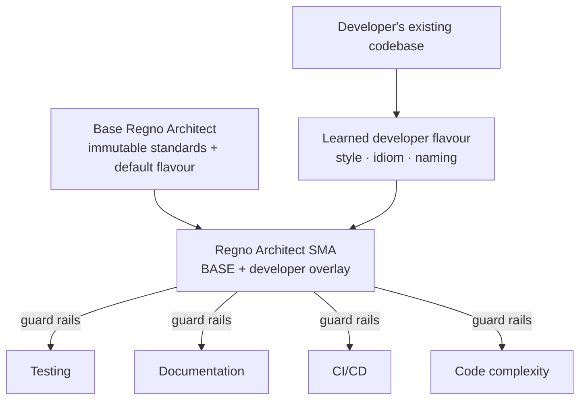

# Regno Architect — Vision & Cloning Model

> Locked-in fundamentals. North star for everything we build next.

## What an SMA is

> **Subject Matter Expert (SMA)** — a selectable expert profile for architect jobs, centered on
> a focus area (e.g. an F1 Race Engineer centered on F1, telemetry and aero). Knowledge is shared
> across all jobs, but an SMA *centers* its knowledge on its focus tags. An SMA is **not** a new
> stack — there is exactly **one** architect (this application).

## The goal

An exact replica of the entire **Regno AI Architect**, used to **clone the stack per developer**:

1. A **base Regno Architect** ships with the default Regno coder: standards, conventions, patterns,
   practices, and style/flavour.
2. When a new developer joins, we provision a **fresh stack** from the base.
3. We point the system at the new developer's **existing codebase** so it learns to code like them —
   **without** overriding the base.

## Non-negotiable base standards (the immutable core)

| # | Standard | Why |
|---|---|---|
| 1 | Testing strategy | always enforced |
| 2 | Documentation | every artifact documented |
| 3 | CI/CD | consistent delivery pipeline |
| 4 | Code complexity | hard limits, not negotiable |

The learned **developer flavour** is an *overlay* on top of these — it changes style, idiom, and
naming, but never the four standards above.

## Docs are part of the base

The entire `docs/` corpus (332 docs, pulled from regno.ai) is part of the **default build** and the
**database**:
- Baked into the base image (`COPY docs ./docs`) — every cloned Agent machine ships with it.
- Seeded into MongoDB `cortex_index` on every clone (raw, always) and Qdrant `doc_search`
  (embeddings, when `OPENAI_API_KEY` is set).

## Architecture

- **Base layer** = versioned, immutable profile + patterns, injected into every run with highest priority.
- **Developer layer** = patterns/memories learned from their code, tagged to the developer, injected as style.
- **Enforcement** = the four base standards are guard rails the agent cannot violate.

## Cloning model

- There is **one architect** — this application. To create another architect, **deploy a whole new
  copy of this repo** (a k3s namespace with its own brain) — see `clone-developer.sh` /
  [`docs/engineering/15-per-developer-cloning.md`](docs/engineering/15-per-developer-cloning.md).
- **SMAs** are *not* new stacks — they are selectable expert profiles created at `/app/agents`
  (name → focus tags → disciplines/languages). Knowledge is shared across all jobs; an SMA
  centers retrieval on its focus tags.
- The base standards are shared/versioned; the developer **flavour** is an overlay (now the
  `developer` field on an SMA).

## Documentation telemetry (everything is documented)

Every thing the system runs or builds is recorded:
- **Execution log** — `cortex_executions` (already exists).
- **Artifact log** — every file/app the agent produces, with rationale (to be built).
- **Change log** — what changed, why, and against which standard.

## Phased plan

1. **Base standards** — author `standards/` (coding, testing, documentation, CI/CD, complexity) and
   ship as the base profile/patterns, marked immutable.
2. **Flavour learning** — ingest a developer's repos → patterns tagged to that developer (reuse
   `seed-history`/`seed-github`, add a developer/tenant tag).
3. **Persona overlay** — the `regno-architect` agent = base (priority) + developer flavour (style).
4. **Per-developer cloning** — one k3s namespace per developer, bootstrapped from base + flavour.
5. **Documentation pipeline** — every execution + artifact auto-documented.

---

*Captured 2026-08-28 — do not lose.*
