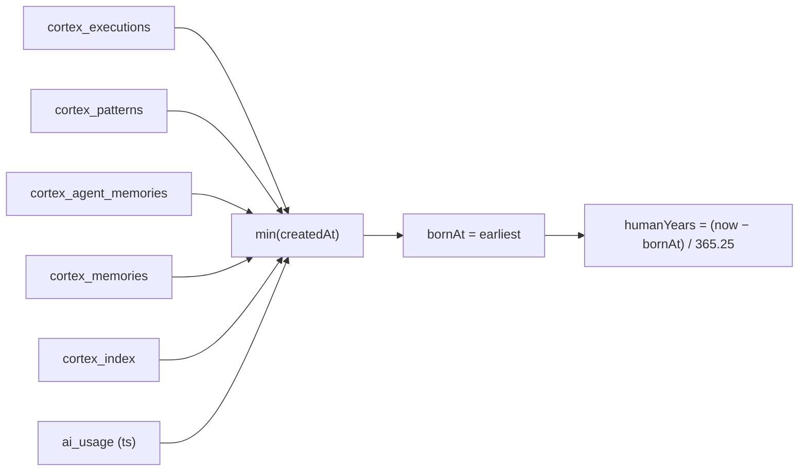

# Architect Age & Intelligence

> Why the sidebar has a little hourglass, two bars, and some evolution icons — and what the popup
> is actually telling you. Target audience: anyone who clicked it and wants the receipts.

## What you're looking at

The last item in the **Intelligence** section of the sidebar is a tiny dashboard for the Architect
(the AI itself). It shows two horizontal bars:

| Bar | Meaning | Icons |
|---|---|---|
| **Human years** | Real wall-clock time since the Architect's earliest recorded activity (first seed / first execution / first LLM call). | 🦧 ape → 🧍 upright walker → 🧑‍🚀 astronaut |
| **AI years** | The gimmick: `human years × aging rate`, where the aging rate grows with everything it has learned. | 🧮 abacus → 💻 terminal → 🤖 robot → 🧠 neural net |

Click the widget to open the full popup with the numbers, the formula, and the charts.

## How human years are computed

The endpoint (`GET /api/architect`) finds the **earliest timestamp** across the activity stores:



It's real elapsed time, not a made-up birthday — a fresh clone shows `0` until it has done
something.

## How AI years are computed (the gimmick)

An AI "ages" **60× faster** than a human, and every thing it learns makes it age faster still:

```
intelligenceScore = 2.00·ln(1+docs) + 1.50·ln(1+patterns) + 1.20·ln(1+memories)
                  + 1.00·ln(1+executions) + 0.05·ln(1+tokens)
multiplier        = 60 + intelligenceScore   (clamped to ≤ 400)
AI years          = human years × multiplier
```

The popup's **"The formula"** section shows each term as a bar — that's the "how we got these
figures" proof. The bigger the knowledge stores, the faster the Architect ages.

## Reading the popup

| Section | What it shows |
|---|---|
| **Big readouts** | The two ages, the aging rate (multiplier), and the learning score. |
| **The formula** | One bar per learning input (documents, patterns, memories, executions, tokens) with its log contribution. |
| **Intelligence makeup** | Absolute counts across every knowledge store (documents, facts, wisdom, memories, entities, patterns, evaluations, executions, SMAs, showcases). |
| **How much it's thought** | Tokens per day over the last 30 days, plus the top models by token volume and cost. |

## FAQ

**Why is my AI years `0`?** — Nothing has been recorded yet. Seed the brain (`npm run db:seed`)
and run a real execution; the bars come alive.

**Do the colors change with the theme?** — Yes. The evolution icons are inline SVG using
`currentColor` and every bar uses the theme's `--signal` / `--good` variables, so it matches all
seven themes.

**Is this real intelligence?** — No. It's a deterministic, documented formula over real counts —
a fun heuristic, not a benchmark.
