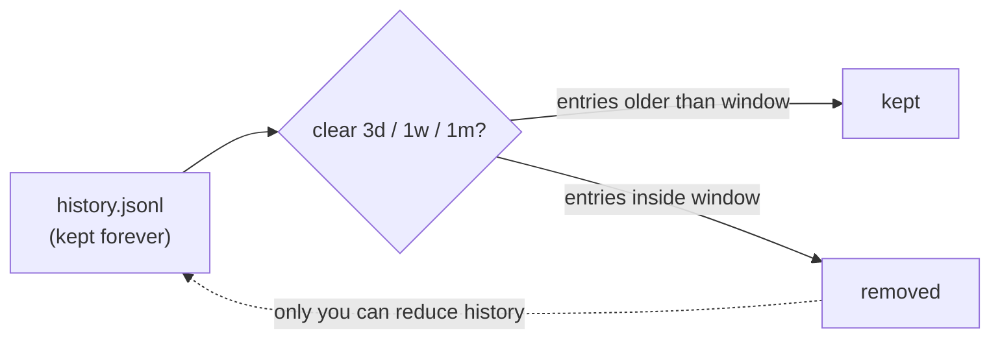

# CLI Command History

> The `regno` CLI keeps **every command you run forever**. It logs one-shot invocations
> and, when you start it with no arguments, opens an interactive shell with arrow-key
> recall across all past sessions. History is append-only — it is only ever reduced by
> you, in chunks of **3 days**, **1 week**, or **1 month** (or a full wipe).

## Where it lives

History is stored as a JSON-lines file next to your auth:

```text
~/.regno/history.jsonl
```

Each line is one command with a timestamp:

```json
{"ts":1788126654434,"cmd":"run \"build me a notes API\""}
```

- The file is **never trimmed** — every command stays, forever.
- Every command is recorded, even ones that error out or hit a dead API.
- Recording is best-effort: if the file can't be written, the command still runs.

## Interactive shell

Start the CLI with no arguments to get a `regno>` prompt:

```text
$ regno
regno>
```

| Key | Action |
| --- | --- |
| `↑` / `↓` | recall past commands (across **all** sessions) |
| `exit` / `quit` | leave the shell |
| `Ctrl+C` / `Ctrl+D` | leave the shell |

Every line you type is dispatched like a normal `regno` command and appended to
history. The last 100,000 commands are kept in memory for arrow-key recall; the file
itself keeps everything.

## Viewing history

```text
$ regno history
2026-08-30 22:49        run "build me a notes API"
2026-08-30 22:49        remember add user convention: API-first
```

## Clearing history

Clear the last window of history in chunks:

```text
$ regno history clear 3d   # drop the last 3 days
$ regno history clear 1w   # drop the last week
$ regno history clear 1m   # drop the last month
$ regno history clear all  # wipe everything
```

Only entries newer than the window are removed — older history survives untouched:



## Notes

- `history ingest` is unrelated — it ingests your repos from `profile/repos.json`.
- Commands are logged in plaintext. Don't put secrets you want hidden into a CLI
  command — `history clear` is the way to scrub them afterwards.
