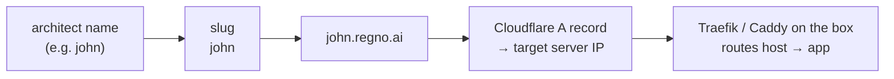

# Cloudflare DNS for new Architects

When you provision a new Regno Architect, its name becomes a subdomain of the root
domain: a developer named **john** gets `https://john.regno.ai`, **darren** gets
`https://darren.regno.ai`, and so on.

## How it works

The architect name (or *slug*) must be lowercase with no spaces — letters, digits
and hyphens only. The provisioning flow turns it into a Cloudflare DNS record:



The record is **proxied** through Cloudflare (orange cloud), so TLS terminates at
the edge and the origin only serves plain HTTP on port 80 — the same topology the
production `john.regno.ai` system uses.

## The script

Everything lives in `scripts/cloudflare-dns.mjs`:

```bash
# Create / update john.regno.ai → 213.32.7.227 (proxied)
node scripts/cloudflare-dns.mjs upsert john 213.32.7.227

# Same, but DNS-only (no Cloudflare proxy)
node scripts/cloudflare-dns.mjs upsert john 213.32.7.227 --no-proxy

# Remove a record (idempotent)
node scripts/cloudflare-dns.mjs delete john

# See every record under the root domain
node scripts/cloudflare-dns.mjs list
```

It needs a Cloudflare API token with **Zone → DNS → Edit** permission, supplied as:

```ini
CF_API_TOKEN=...
CF_ZONE_ID=...          # optional — resolved from the root domain if omitted
REGNO_ROOT_DOMAIN=regno.ai   # default
```

## Provisioning hooks

Both deploy paths call the script automatically when the right env vars are set:

- **`deploy.sh`** (fresh server): registers the domain after the stack is up.
  Set `CF_API_TOKEN` (and optionally `SERVER_IP`, otherwise the public IP is
  auto-detected).
- **`clone-developer.sh`** (k3s namespace): registers the slug when both
  `CF_API_TOKEN` and `SERVER_IP` are set.

If the token is missing the scripts skip DNS and print a note — provisioning still
succeeds, and you can run the script by hand afterwards.

## Name rules

- Lowercase `a–z`, digits `0–9`, and hyphens `-` only — **no spaces**.
- Must start and end with a letter or digit.
- Reserved names are rejected (`www`, `api`, `admin`, `docs`, `mail`, `cortex`, …).

## Troubleshooting

| Symptom | Fix |
|---------|-----|
| `CF_API_TOKEN is not set` | Export the token, or re-run with it set. |
| `No Cloudflare zone found for "regno.ai"` | Set `CF_ZONE_ID` explicitly. |
| Cloudflare returns `521`/`522` | Origin isn't reachable on port 80, or SSL/TLS mode is wrong — use **Flexible**. |
| Site loads but wrong app | Add the new host to the box's routing (`{$DOMAIN}` in Caddy, or an Ingress rule for the host). |
