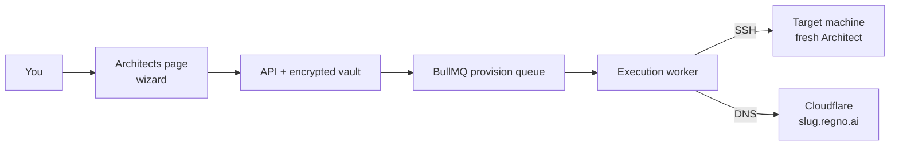

# Creating Architects (provisioning)

The **Architects** page (`/app/architects`) is the Mothership control plane. From it you
provision a full Regno Architect for each developer: a complete stack deployed over SSH onto
its own machine, with its name registered as a subdomain.

## Model

- **Mothership** — this app, running a lightweight profile (web + execution + mongo + redis).
- **Architect** — the full stack (Neo4j, Mongo, Qdrant, Redis, web, execution, realtime, Caddy)
  on its own machine (8 GB+ RAM recommended for Neo4j's 4 GB heap).

## Authentication

The page uses the **same SSO as `sysadmin.regnocloud.com`** — Regno Identity
(`identity.regnocloud.com`). An unauthenticated visitor is redirected there, and only users
with an admin/sysadmin role can open the wizard. The first SSO user is granted the owner role.

## Wizard steps

1. **Developer** — full name, architect name (slug), email, GitHub username. The slug becomes
   `slug.regno.ai` (lowercase, digits, hyphens — no spaces).
2. **Target machine** — host/IP, SSH user/port, deploy mode, **wipe-before-deploy** toggle,
   and SSH credentials (private key or password).
3. **AI provider keys** — OpenAI, Anthropic, Google AI, DeepSeek (all optional).
4. **Email / SMTP** — prefilled with the standard Regno defaults.
5. **Databases & security** — Neo4j/Mongo passwords and JWT secret (⚡ auto-generates), GitHub
   org + token (with a **Test** button), Docker Hub credentials.
6. **Review & launch** — masked summary, then Save & launch.

Secrets are stored AES-256-GCM encrypted as one vault entry per architect
(`architect:<slug>:env`) — never written plaintext.

## Wipe & redeploy

Tick **"Wipe existing deployment before build"** to `docker compose down -v` on the target
before rebuilding. Use this to repurpose an existing box (e.g. `213.32.7.227`) as a fresh
Architect under a new name.

## Name rules

- Lowercase `a–z`, digits `0–9`, hyphens `-` — no spaces.
- Reserved names are rejected (`www`, `api`, `admin`, `cortex`, …).

## After launch

The list shows each Architect's status (`draft → provisioning → healthy/error`). A failed
provision surfaces its error inline; fix it and press **Launch** again.

To push a later code change (or rotated key) to a healthy Architect, press **Redeploy** —
it re-runs the worker without wiping volumes (`git pull --ff-only` + `deploy.sh`). See the
**No-SSH Operations** guide for the full hands-off workflow.

## Live progress while provisioning

Once launched, the wizard shows a step-by-step progress list so you can see exactly what the
worker is doing instead of a bare "provisioning":

- Connecting to the target host
- Preparing `/opt/regno`
- Fetching code (clone or `git pull --ff-only`)
- Writing `.env.prod`
- Wiping existing deployment (only when **wipe** is ticked)
- Building & seeding via `deploy.sh` — the longest step
- Registering Cloudflare DNS
- Architect ready at `slug.regno.ai`

Each step turns ✓ as it completes; the in-flight step pulses ●, and a failure appends a ✕
step with the exact SSH/deploy error. This is polled from the Architect record (`progress`
array), written by the provisioning worker on every stage.

## Live telemetry (Regno Standard)

Once an Architect is up, it reports a heartbeat back to the Mothership every 30 seconds —
encoded as a **Regno Standard** document set (ConfigDoc + ParamScalarValueDoc + EventDataDoc,
see `docs/engineering/31-architect-telemetry.md`). The list page shows:

- **Per-service chips** — Mongo, Redis, Qdrant, Neo4j (green = reachable, red = down).
- **Version + health + "seen Ns ago"** — from the last received heartbeat.

No heartbeat in ~2 minutes means the Architect is unreachable. The Mothership learns each
Architect's URL via `MOTHERSHIP_URL` (set in the Mothership's `.env.prod`); the Architect
learns who to report to from its own `.env.prod`, which the provisioner writes automatically.

