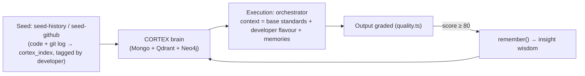

# Initial Setup & Growing the CORTEX Brain

> How to take a fresh Regno Architect from "running" to "learning", then keep growing its brain.
> Target audience: new devs, and devs who need a refresh.

## What "growing the brain" means

Your Architect isn't a static model — it's a **compounding brain**. Every good build writes a
memory; every future run reads those memories back into its context. Growth happens through
**four channels** that compound:

| Channel | How | Mechanism |
|---|---|---|
| **Seed** | Ingest docs + standards + a dev's code/git history | `seed-*` scripts → `cortex_index` + Qdrant |
| **Curate** | Manually store memories & patterns | `/app/cortex` page |
| **Work** | Run real executions; each good one auto-writes an insight | `orchestrator.ts` → `remember()` when score ≥ 80 |
| **Recall** | Next run reads memories + flavour back into context | `context.ts` prompt injection |



## Prerequisites

| Check | How to verify |
|---|---|
| **Valid LLM key** | Add provider keys in `/app/settings` after install, or set `OPENAI_API_KEY` in root `.env` before first boot. **#1 blocker.** A key returning `429 insufficient_quota` silently switches to *simulated* output — you'd be learning fake insights. Confirm it works first. |
| **Infra up** | Mongo, Qdrant, Neo4j, Redis (`npm run db:up` locally, or the k3s namespace). `/app/health` shows each store's status. |
| **Web app running** | `npm run dev:web` → http://localhost:5173 (dev), or the deployed app. |

## Step 0 — Unblock the LLM key (do this FIRST)

1. Open `/app/settings` and save a **valid** provider key under **LLM API Keys**.
2. Click **Restart execution** in the same Settings panel so Cortex Flow jobs hydrate the saved key.
3. For local `.env` development, you can still export the key before starting the web dev server:
   ```bash
   export OPENAI_API_KEY=$(sed -n 's/^OPENAI_API_KEY=//p' .env)
   npm run dev:web
   ```
4. Confirm **real model calls** on `/app/health` (AI usage section) — not errors.

## Step 1 — Seed the base brain

Give it its starting corpus (all 332 docs + best-practice standards):

```bash
npm run db:up
npm run db:init && npm run db:seed
```

> On a Mothership-provisioned Architect this is automatic: the provisioning worker runs
> `deploy.sh`, which seeds agents / standards / brain after the stack is up.

**Verify:** `/app/cortex` shows a non-zero **KNOWLEDGE DOCS** count; `/app/oracle` returns results.

## Step 2 — Teach it a developer's flavour (via an SMA)

Your learned style is a **developer flavour** — a style overlay that emulates your code but
**never** overrides base standards. In the SMA model, the flavour lives on a **Subject Matter
Expert** profile (see `docs/engineering/20-sma-subject-matter-experts.md`):

1. In **System → SMA** (`/app/agents`), create an SMA (e.g. "F1 Race Engineer").
2. Give it **focus tags** (e.g. `F1`, `telemetry`, `aerodynamics`) — retrieval **boosts** docs
   matching those tags (re-ranks, never filters; all knowledge stays shared).
3. Optionally set a **developer** on the SMA (your learned flavour) plus **disciplines /
   languages** (injects the matching best-practice standards).
4. In `/app/chat`, select the SMA for a job — a `v2_sma` event fires and the context includes a
   "Subject Matter Expert" + focused-knowledge block.

To ingest your code as a developer flavour:

```bash
DEVELOPER=<your-name> node scripts/seed-history.mjs   # uses profile/repos.json → C:/repos/regno-ai
```

**Verify:** search returns code chunks tagged with your developer name; SMA focus tags re-rank
results (all knowledge remains reachable).

## Step 3 — Curate: teach it directly

On the **CORTEX page** (`/app/cortex`):
- **Memories** — store `profile` (your conventions), `note`, and `insight` entries.
  `profile`-category memories are injected into every run as `userMemories`.
- **Patterns** — store proven approaches ("SvelteKit CRUD API", "Go service layout").
  These sync to Mongo + Qdrant + Neo4j.

## Step 4 — Let it learn from work

The **Architect chat** (`/app/chat`) is the growth engine: each execution scoring **≥ 80**
auto-writes an insight memory the *next* run reads back.

1. Ask it to build something small (start with your own codebase so `read`/`grep` tools have value).
2. Watch `/app/executions` — check the **final score**.
3. Verify on `/app/cortex` that an **insight** memory appeared.
4. Run a second, similar task — the insight should appear in its context.

> ⚠️ Use the **Architect chat / executions** for growth, not Genesis pipelines — Genesis nodes
> call the LLM but don't write wisdom back. Auto-learning happens only in the Cortex Flow
> orchestrator (`/api/executions`).

## Step 5 — Verify the loop is compounding

| Check | Where | Should show |
|---|---|---|
| Knowledge docs seeded | `/app/cortex` | non-zero count |
| Developer flavour searchable | `/app/oracle` | code chunks tagged `developer:<you>` |
| Insight memories growing | `/app/cortex` → Memories | new entries after each good run |
| Memory used in next run | run a 2nd task | output reflects the prior insight |
| LLM calls shrinking | `/app` (SERVED PHASES) | served phases > 0 after repeated tasks |

## Known limitations (don't be surprised)

- **Only ≥80 scores are learned** — low-quality runs intentionally write nothing.
- **Memory recall is recent-first, not semantic** — context pulls the 5 most-recent memories,
  not the most relevant. Semantic retrieval exists (Oracle/Nexus, knowledgeBase tool) but isn't
  the default context path yet. This is the biggest quality ceiling on growth.
- **No automatic pattern extraction yet** — only insights are auto-written; patterns are manual,
  and there's no confidence decay.
- **Wisdom memories skip Neo4j** (Mongo + Qdrant only); patterns use all three stores.
- **LLM key 429 = silent simulation** — pipelines fall back to simulated analysis so they never
  hard-fail. Always confirm real model calls on `/app/health`.

## Where things live

| Concern | File |
|---|---|
| Learning write-back (insight) | `packages/flow/src/orchestrator.ts` |
| Context injection (standards + flavour + memory) | `packages/flow/src/context.ts` |
| Three-store sync | `packages/db/src/sync.ts` |
| Recall & Serve decision layer | `packages/cortex/src/recall.ts` |
| Code ingestion | `scripts/seed-history.mjs`, `scripts/seed-github.mjs` |
| SMA profiles (focus + flavour) | `/app/agents` + `/api/agents` |
| Subject Matter Expert model | `docs/engineering/20-sma-subject-matter-experts.md` |
