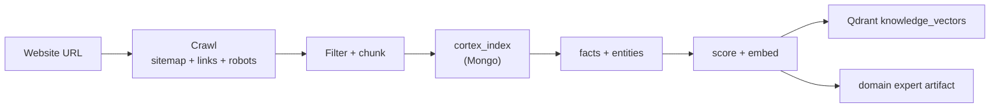

# Knowledge Ingestion (Seed a Website)

> Turn any website (e.g. `regnostandard.com`) into a searchable, fact-extracted domain in the CORTEX brain — crawl → clean → index → facts → entities → vectors → expert artifact.

**Target audience:** anyone who wants to grow the brain from an external site, not just local `docs/`.

## What this is

The `@regno/ingest` pipeline is the "Seed" channel for external knowledge. It crawls a site (sitemap + link following, robots.txt-aware), converts pages to Markdown, and runs a 10-phase pipeline that lands everything into the standard knowledge stores:

| Output | Where |
|---|---|
| Raw pages (chunks) | Mongo `cortex_index` |
| Atomic facts | Mongo `cortex_knowledge_facts` |
| Named entities | Mongo `cortex_entities` + Neo4j `:Entity` |
| Fact vectors | Qdrant `knowledge_vectors` |
| Compiled domain expert | Mongo `cortex_domain_experts` |
| Progress / status | Mongo `knowledge_seed_status` |



## Quick start (CLI)

```bash
npm run db:up                          # Mongo + Qdrant (+ Neo4j, Redis)
npm run db:ingest-site -- --url https://www.regnostandard.com --description "Universal telemetry data standard"
```

The CLI prints live progress (`[ 42%] facts    Extracting atomic facts…`) and a final summary with a quality grade.

## Quick start (API)

```bash
# Start ingestion (fire-and-forget)
curl -X POST http://localhost:5173/api/knowledge/ingest \
  -H 'content-type: application/json' \
  -d '{"url":"https://www.regnostandard.com","description":"Universal telemetry data standard","maxPages":30}'
# → { "ok": true, "seedId": "…" }

# Poll status
curl http://localhost:5173/api/knowledge/ingest/<seedId>

# List all seeds
curl http://localhost:5173/api/knowledge/seeds
```

## Options

| Option | Default | Meaning |
|---|---|---|
| `url` | — | Target site (required) |
| `domain` | host minus TLD (`regnostandard.com` → `regnostandard`) | Cortex domain key |
| `description` | — | Drives relevance filter + scoring anchor (recommended) |
| `maxPages` | 30 | Crawl page cap |
| `depth` | 2 | Link-follow depth |
| `rateLimitMs` | 800 | Polite delay between fetches |
| `phases` | all | Subset: `crawl,filter,process,index,facts,entities,score,expert,assets,finalize` |
| `seedId` | new | Pass an existing id to resume |
| `llm` | true | `false` = deterministic fallbacks (no LLM) |
| `assets` | true | Download images/PDFs to GridFS `cortex_assets` |

## The 10 phases

1. **crawl** — BFS over `sitemap.xml` + same-host links; respects `robots.txt`; HTML → Markdown.
2. **filter** — relevance vs `description`; off-topic pages are *reclassified* (`domain.other`), never discarded.
3. **process** — heading-aware chunking of docs > 8000 chars into `(Part N/M)`.
4. **index** — idempotent bulk upsert into `cortex_index` (never overwrites existing content).
5. **facts** — LLM extracts 5–20 atomic facts per page into `cortex_knowledge_facts`.
6. **entities** — named entities → `cortex_entities` + Neo4j graph nodes.
7. **score** — embedding-cosine relevance; vectors stored to Qdrant in the same pass.
8. **expert** — all pages compiled into a versioned domain-expert artifact (hash-diffed).
9. **assets** — images/PDFs → GridFS, linked back to pages.
10. **finalize** — quality grade (A–F from score distribution) + status → `done`.

## Keyless mode

If no `OPENAI_API_KEY` is set, every LLM phase degrades gracefully: filtering uses keyword scoring, facts are sentence-extracted, entities use a capitalized-term regex, and the expert artifact is a deterministic condensation. The pipeline **always completes** — you can re-run the same `seedId` later with a key to upgrade facts/vectors (markers make it incremental).

## Resume / checkpoint

Every phase is marker-based, so a crash (or a partial run) resumes cleanly:

| Phase | Resume marker |
|---|---|
| Crawl | pages persisted in `knowledge_staging` (delta re-crawl) |
| Index | upsert by `{domain, sourceUrl, title}` |
| Facts | `_factsExtracted` per page |
| Entities | `_entityExtracted` per fact |
| Score/embed | `_embeddedAt` per fact |

Re-run with the same `seedId` to pick up where it stopped.

## Verify

- `/app/cortex` → **KNOWLEDGE DOCS** count grows for the domain
- `/app/oracle` → ask a question; results surface from the ingested domain
- `/api/docs` → ingested docs grouped by domain
