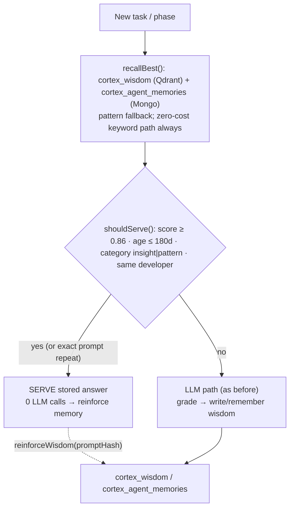

# Why Your LLM Bills Shrink (Recall & Serve)

> The CORTEX brain learns from every good build, then serves known answers **from memory —
> with zero LLM calls** instead of re-calling the model. This guide explains how, how to verify
> it, and how to tune it. Full design: `docs/architecture/RECALL_SERVE_DECISION_LAYER.md`.

## The idea

Before each phase of an execution calls the LLM, the orchestrator asks the brain:

1. **Have I already done something very close to this?** (`recallBest()`)
2. **Is the match confident + fresh + my own flavour?** (`shouldServe()`)
3. **Yes → serve the stored answer, 0 LLM calls.** No → call the LLM as before.

Repeated tasks stop spending tokens. Only genuinely novel work does.



## The decision gate (defaults)

| Rule | Default | Meaning |
|---|---|---|
| Match score | ≥ `0.86` | Only near-repeat quality is served |
| Memory age | ≤ `180` days | Don't serve stale answers |
| Category | `insight` / `pattern` | Only full answers/recipes |
| Developer | same as the request | One dev's flavour is never served to another |
| **Exact repeat** | always served | Same prompt again → serve, no LLM |

## How to verify it's working

1. Run the **same prompt twice** (from `/app/executions` or the Architect chat):
   - 1st run → normal LLM path, an `insight` memory is written.
   - 2nd run → the **SERVED PHASES** counter on the dashboard (`/app`) goes up, and the
     Executions page shows a **✓ N served** badge with a low **LLM calls** count.
2. `/app/health` → `served` block: executions / servedPhases / llmCalls.
3. For a quick API check:
   ```bash
   curl -s http://localhost:5173/api/health | jq '.served'
   ```

## How to tune it

Per-execution (via `settings` in `POST /api/executions`) or globally via env in root `.env`:

| Setting | Env | Default |
|---|---|---|
| Master switch | `CORTEX_SERVE_ENABLED` | `true` |
| Min match score (0..1) | `CORTEX_SERVE_MIN_SCORE` | `0.86` |
| Max memory age (days) | `CORTEX_SERVE_MAX_AGE_DAYS` | `180` |
| Whole-task short-circuit | `settings.serveWholeTask` | `false` (opt-in) |

- **Too few serves?** Lower `CORTEX_SERVE_MIN_SCORE` (e.g. `0.75`) or raise `CORTEX_SERVE_MAX_AGE_DAYS`.
- **Want maximal savings on repeated work?** Set `serveWholeTask: true` per call — the whole
  task is served from memory when confident.

## Honest caveats

- **Semantic recall needs an embedding key.** Without `OPENAI_API_KEY`, serving uses the
  zero-cost keyword path (still works, but coarser matching).
- **Conservative by design.** The 0.86 threshold means only near-repeat work is served — this
  protects quality. Lower it only if you accept some risk.
- **Served answers are trusted on their stored score** (not re-graded). Future work may add an
  optional cheap confirmation call.
- **Memories written before this feature** lack `promptHash`, so they can't be exact-repeat
  matches and may be filtered by age.

## Where it lives

| Concern | File |
|---|---|
| Recall + decision gate | `packages/cortex/src/recall.ts` |
| Orchestrator integration | `packages/flow/src/orchestrator.ts` |
| Wisdom write + reinforcement | `packages/db/src/sync.ts` |
| Design doc | `docs/architecture/RECALL_SERVE_DECISION_LAYER.md` |
