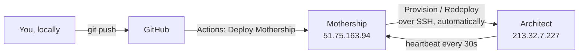

# No-SSH Operations (let the Mothership do it)

> Stop SSHing into boxes. Everything — updating the Mothership, provisioning Architects,
> and pushing code changes to them — happens through `git push` and the Mothership UI.
> Target audience: anyone who has been `ssh`-ing into the VPS to deploy.

## The two-box model



- **Mothership** — the control plane (web + execution + mongo + redis). It is deployed by
  GitHub Actions; you never touch it by hand.
- **Architect** — each developer's full stack. It is deployed and updated **by the Mothership's
  provisioning worker**, not by you.

## Rule of thumb

| You want to… | Do this | Do NOT do this |
|---|---|---|
| Ship a change to the Mothership | `git push origin master` | `ssh … 'git pull && docker compose up'` |
| Create a developer's stack | Mothership → **Architects** → **New Architect** | `ssh` into the target box |
| Update a developer's stack | Mothership → **Architects** → **Redeploy** | `ssh` into the target box |
| Rotate an API key on an Architect | Redeploy after saving it in the wizard (or `.env.prod` via the wizard's env step) | `ssh … nano .env.prod` |

## 1. Updating the Mothership

Push to `master` (or `main`). The `Deploy Mothership` GitHub Actions workflow does the rest:

1. SSHes into the Mothership VPS with the repo secret `MOTHER_SSH_KEY`.
2. `git pull --ff-only` in `/opt/regno`.
3. Rewrites `.env.prod` from GitHub secrets (so secrets never live in the repo).
4. `docker compose -f docker-compose.mothership.yml --env-file .env.prod up -d --build`.
5. Prints `docker compose ps`.

To run it without a new commit: **Actions → Deploy Mothership → Run workflow**.

### One-time setup (already done, or do once)

GitHub repo → **Settings → Secrets and variables → Actions → Secrets**:

| Secret | Value |
|---|---|
| `MOTHER_SSH_HOST` | Mothership VPS IP, e.g. `51.75.163.94` |
| `MOTHER_SSH_USER` | `ubuntu` (or `root`) |
| `MOTHER_SSH_KEY` | private key for that user (no passphrase) |
| `MOTHER_JWT_SECRET` | long random hex (persistent across deploys) |
| `MOTHER_CREDENTIALS_KEY` | long random hex (persistent) |
| `REGNO_IDENTITY_BASE_URL` | `https://identity.regnocloud.com` |
| `CF_API_TOKEN` | Cloudflare Zone → DNS → Edit |
| `CF_ZONE_ID` | the `regno.ai` zone id |
| `REGNO_ROOT_DOMAIN` | `regno.ai` |
| `MOTHERSHIP_URL` | `https://mothership.regno.ai` — Architects report telemetry here |

> The deploy step uses `sudo docker compose` and adds the SSH user to the `docker` group on
> first run, so the box is self-managing after bootstrap — no permission tweaks by hand.

## 2. Provisioning an Architect

Mothership → **Architects** → **New Architect**. Fill the six wizard steps (developer, target
machine + SSH key/password, AI keys, SMTP, databases/security, review) and **Save & launch**.
The provisioning worker drives the target machine for you:

```
prepare /opt/regno → clone-or-pull repo → write .env.prod → (wipe?) → deploy.sh → Cloudflare DNS
```

Watch live progress in the wizard, and the status column on the Architects page.

## 3. Updating an Architect (Redeploy)

On the Architects page, a healthy Architect shows a **Redeploy** button next to **Delete**.
Clicking it re-runs the provisioning worker against that machine:

- `git pull --ff-only` (no data loss),
- rewrites `.env.prod` from the stored vault secrets,
- rebuilds + restarts the stack,
- re-registers Cloudflare DNS.

It does **not** wipe volumes unless the Architect's **wipe** flag is set. Use **Redeploy** to
ship a code change or a rotated key; use **New Architect** with **wipe** ticked only to
repurpose a box.

## 4. When you might still need SSH

Only for true one-offs that happen outside the normal flow, e.g.:

- the very first bootstrap of a brand-new VPS (`bash deploy-mothership.sh`, run once),
- recovering a box whose Docker engine itself is broken.

Everything else is a push or a button click.
