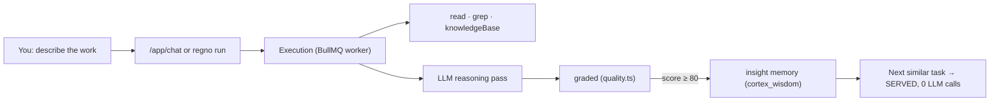

# Doing Your Work in the Architect

> How to actually start "living in" the Architect — giving it your real work, watching it
> learn, and applying its output. The Architect is **one reasoning brain** you talk to; you
> steer it from two places: the **Architect chat** (`/app/chat`) and the **`regno` CLI**.

## What "doing everything in the Architect" means (be honest)

- You describe a task in plain English. The Architect routes it to an agent, builds a
  plan, reads your repo + your CORTEX brain, and produces a **plan + code + analysis** in
  chat output. It does **not** edit files in the repo or commit to git itself — you apply
  the output (today's toolset is read-only + knowledge).
- **Real tools it has:** `read` (read a repo file), `grep` (search files), `knowledgeBase`
  (semantic search over the doc corpus + your seeded history), `emailSend`.
- **Stubs (not implemented):** `webSearch`, `pythonExec`.
- **The payoff is compounding:** each execution scoring **≥ 80** auto-writes an *insight*
  memory. The next time you ask something similar, **Recall & Serve** answers **from
  memory with 0 LLM calls** (`/app` shows "SERVED PHASES").



## Prerequisites (check once)

| Check | Where | Should show |
|---|---|---|
| Signed in | https://john.regno.ai → **Sign in** | app shell sidebar |
| Infra healthy | `/app/health` | mongo / qdrant / neo4j / redis all ✓ |
| Real LLM key | `/app/health` → AI usage | real calls + cost, not errors |
| Brain seeded | `/app/cortex` | non-zero **KNOWLEDGE DOCS** |

## Entry point 1 — the web chat (recommended to start)

1. Go to **https://john.regno.ai** and **Sign in** (you're on the landing page until you do).
2. Open **Build → Architect** (`/app/chat`).
3. Pick your **SMA** from the selector (Base Regno Architect by default; or the expert
   profile you created in **System → SMA**, which centers retrieval on its focus tags).
4. Describe a real task in plain English. Start with something **in your own codebase**
   so the `read`/`grep` tools have value:
   - `Read src/routes and tell me how auth is wired here`
   - `Plan a small notes API with auth for this repo — show me the code`
5. Wait — the chat polls the execution (up to ~3 min) and shows the output.

## Entry point 2 — the CLI (drive it from the terminal)

The `regno` CLI stores your session in `~/.regno/auth.json` and keeps a forever history.

```bash
export REGNO_URL=https://john.regno.ai        # default is localhost:5173
regno login --email you@x.com --password '...' # or `npx regno login …`
regno run "Plan a small notes API with auth" --depth standard   # enqueue an execution
regno history                                 # every run, kept forever
regno remember "regno apps use SvelteKit + Svelte 5 runes" --category note
```

> `regno run` returns the job id — open `/app/executions` to watch it finish, then copy
> the output from there.

## After every run — close the learning loop

| Step | Where | What to check |
|---|---|---|
| 1. Did it finish? | `/app/executions` | status, output |
| 2. Was it any good? | same page | **final score** |
| 3. Did it learn? | `/app/cortex` → Memories | a new `insight` if score ≥ 80 |
| 4. Is it compounding? | `/app` dashboard | **SERVED PHASES** grows after repeats |

Run the **same task twice** to see Recall & Serve kick in: run 1 writes the insight,
run 2 shows a **✓ served** badge and a low LLM calls count.

## A realistic daily loop

1. **Curate:** drop anything you learned into `/app/cortex` (memories / patterns).
2. **Work:** give it one focused task via `/app/chat` or `regno run`.
3. **Apply:** take the plan/code it returned and put it in the repo (it won't write files).
4. **Feed back:** if it did great, re-ask or keep the pattern; every ≥80 run teaches it.

## Gotchas

- **No write tools yet** — don't expect it to push code to git; it reasons and drafts.
- **Only ≥80 scores are learned** — low-quality runs intentionally write nothing.
- **Memory recall is recent-first** — context pulls the 5 most-recent memories, not the
  most relevant (semantic retrieval exists via `knowledgeBase`, but isn't the default
  context path yet).
- **LLM key 429 = silent simulation** — if the key dies, it falls back to simulated
  output and you'd be learning fake insights. Check `/app/health` AI usage first.
- **CLI + auth:** set `REGNO_URL` to the deployed host or every `regno` call hits
  `localhost:5173`.

## Where things live

| Concern | File / page |
|---|---|
| Chat → execution wiring | `apps/web/src/routes/app/chat/+page.svelte` |
| Execution pipeline | `packages/flow/src/orchestrator.ts` |
| Tools (read/grep/knowledgeBase) | `packages/flow/src/tools.ts` |
| Learning write-back | `orchestrator.ts` → `remember()` |
| Recall & Serve | `packages/cortex/src/recall.ts` |
| CLI | `packages/cli/src/cli.ts` (guide: `cli.md`) |
| SMA profiles | `/app/agents` (guide: `initial-setup.md` Step 2) |
