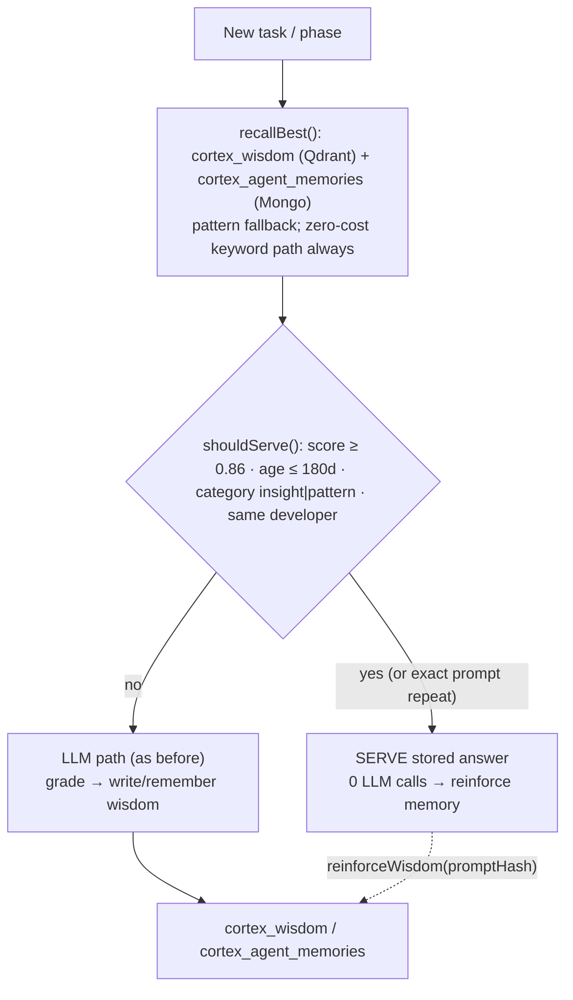

# Recall & Serve — Decision Layer (reduce LLM calls)

> Status: implemented (2026-08-30) · Core files: `packages/cortex/src/recall.ts`,
> `packages/flow/src/orchestrator.ts`, `packages/db/src/sync.ts`

## What it is

A decision layer that lets the CORTEX brain answer from memory instead of calling the LLM
every time. When a task (or a phase of a task) closely matches a previously stored, high-quality
outcome, that outcome is **served** with **zero LLM calls**. Only genuinely novel work spends
tokens.

The compounding brain's original loop improves *quality per call* (better context → better
output). Recall & Serve adds the second half: *fewer calls* for repeated/known work.

## Why

Every phase + refine pass in the orchestrator previously fired `chatWithFallback()`. That means
a 3-phase run with one refine = ~5–7 LLM calls, **including the LLM grading call**. Re-running a
similar task burned the same tokens each time despite the brain already holding a good answer.

## How it works

### Retrieval — `recallBest(query, opts)` (`@regno/cortex`)

- **Semantic path** — Qdrant `cortex_wisdom` cosine search (only when `OPENAI_API_KEY` is set).
  Cosine is normalized to 0..1 via `(score + 1) / 2`.
- **Zero-cost path** — TF-IDF-style keyword scoring over Mongo `cortex_agent_memories`
  (`content` + `prompt`). Always available; this is the same philosophy as Zaeem's
  "zero-cost fallback engine" (§9 of `REGNO_AI_ARCHITECTURE_2026.html`).
- **Pattern fallback** — when no wisdom matches, a strongly matching `cortex_patterns` entry
  (via `patternSearch`) can serve.
- **Merge** — semantic + keyword candidates are merged (max score), then **backfilled** with
  metadata (age, `relevanceScore`, `developer`, `promptHash`) from Mongo so both paths are
  consistent.
- **Developer isolation** — an expected developer is never served another developer's flavour.

### Decision gate — `shouldServe(candidate, opts)`

Serves only when (all):

| Rule | Default | Why |
|---|---|---|
| `score ≥ minScore` | `0.86` | Conservative — only near-repeat quality |
| `ageDays ≤ maxAgeDays` | `180` | Don't serve stale answers |
| `category ∈ {insight, pattern}` | — | Only full answers/recipes, not notes |
| same `developer` (when one is expected) | — | Flavour isolation |
| **or** `promptHash` matches incoming prompt | — | Exact repeat is always served |

Defaults are overridable per-execution (`serveMinScore`, `serveMaxAgeDays`) or via env:
`CORTEX_SERVE_ENABLED` (default `true`), `CORTEX_SERVE_MIN_SCORE`, `CORTEX_SERVE_MAX_AGE_DAYS`.

### Orchestrator integration (`@regno/flow`)

1. **Whole-task short-circuit** (opt-in via `settings.serveWholeTask`, default **off**) — if the
   entire task matches a stored memory, skip the phase loop + refine entirely and serve.
2. **Per-phase recall** (on by default) — before each phase's LLM call, try to serve that
   phase's output from memory. Served phases skip the LLM.
3. **Refine loop skipped when served** — if any phase was served, the LLM grading + refine loop
   is skipped entirely (it's the biggest call sink).
4. **Counters + provenance** — each execution records `llmCalls`, `servedPhases`, and
   `servedFrom` (candidate id per served phase). A `v2_served` SSE event is emitted with the
   decision reason.
5. **Reinforcement** — served memories get `relevanceScore += 1` (`reinforceWisdom`), so
   repeatedly-served knowledge gets stronger, exactly like the "compounding" thesis.

**SMA composition** — the orchestrator resolves `developer = settings.developer ?? sma.developer`
and uses it for both context injection and Recall & Serve isolation. A job run under an SMA with a
developer flavour writes and serves wisdom tagged with that developer, so one developer's learned
style is never served to another. Knowledge itself is shared; SMA focus tags only boost retrieval.

### Persistence (`@regno/db`)

`writeWisdom` now stores `prompt`, `promptHash` (short sha-256), `phase`, `score`. Writing a
memory with the same `promptHash` (+ `agentSlug`/`developer`) **reinforces** the existing memory
instead of duplicating it — so a repeated successful prompt strengthens one memory rather than
spamming near-identical insights.

## Config reference

| Setting | Env | Default | Meaning |
|---|---|---|---|
| `serveEnabled` | `CORTEX_SERVE_ENABLED` | `true` | Master switch |
| `serveMinScore` | `CORTEX_SERVE_MIN_SCORE` | `0.86` | Min match score (0..1) |
| `serveMaxAgeDays` | `CORTEX_SERVE_MAX_AGE_DAYS` | `180` | Max memory age (days) |
| `serveWholeTask` | — | `false` | Whole-task short-circuit (opt-in) |

## Verification

1. Builds: `npm run build -w @regno/cortex`, `npm run build -w @regno/flow` → 0 errors.
2. **Loop check** — run the same prompt twice with serving on:
   - 1st run → LLM path, writes an `insight` with `promptHash` + score.
   - 2nd run → `v2_served` event (`exact-repeat` or `served`), `servedPhases > 0`, lower
     `llmCalls`, memory reinforced.
3. **A/B quality** — run N prompts with `serveEnabled` true vs false; `finalScore` must not
   regress (the gate only serves high-confidence matches).
4. **Cost** — compare estimated cost on `/api/health` before/after.

## Known limitations

- **Semantic recall needs an embedding key** — without `OPENAI_API_KEY`, serving relies on the
  keyword path (still zero-cost, but coarser).
- **Gate is conservative by design** — the default 0.86 threshold means only near-repeat work is
  served. Lower it (per-execution or env) to serve more aggressively at some quality risk.
- **Age metadata** — memories seeded before this feature lack `promptHash`/`createdAt`-based
  freshness, so they won't be exact-repeat matches and may be filtered by age.
- **No automatic pattern extraction yet** — only stored insights/patterns can be served; the
  KnowledgeDistiller-style auto-extraction remains a follow-up.
- **Served answers aren't re-graded** — a served answer is trusted on its stored score; if you
  want fresh validation, enable a cheap confirmation call (future work).

## Follow-ups

- Semantic memory retrieval into `buildContext`'s default path (today it is recent-first).
- Background confidence decay job.
- Skills/templates promotion of repeatedly-served executions.
- Optionally re-grade served output with one cheap LLM call before trusting it.
