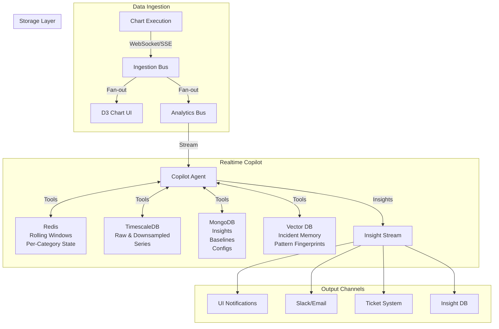
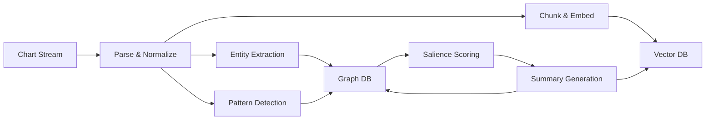

# Hybrid RAG System for Chart Data Insights & Professional Reporting

**Status**: Planning & Design Phase
**Created**: 2025-11-03
**Last Updated**: 2025-11-03
**Version**: 0.1.0

---

## Executive Summary

Design and implement a **dual-layer intelligence system** for real-time and historical chart data analysis:

### Layer 1: Realtime Analytics Copilot (Hot Path)
- **Parallel Stream Processing**: Observes the same chart data stream as D3 in real-time
- **Immediate Detection**: Anomalies, outliers, change points, drift, outages (P50 < 300ms, P95 < 1s)
- **Proactive Alerts**: Auto-generated insights with confidence scores and remediation hints
- **Adaptive Speed**: Handles 1x to 1000x data playback rates seamlessly
- **Multi-Category Intelligence**: Per-category and cross-category pattern detection

### Layer 2: Hybrid RAG System (Cold Path)
- **Vector Store**: Fast semantic recall over chart data, metrics, and temporal patterns
- **GraphRAG**: Multi-hop reasoning, provenance tracking, entity relationships, and causal analysis
- **Historical Insights**: Complex queries over all historical data with deterministic provenance
- **Professional Reporting**: Natural language querying, automated reports, data storytelling

**Goal**: Combine **real-time situational awareness** (streaming copilot) with **deep historical analysis** (RAG) to create an invaluable predictive and diagnostic tool for chart data monitoring and insights.

---

## Table of Contents

### Part A: Realtime Analytics Copilot (Hot Path)
0. [Realtime Analytics Copilot Overview](#0-realtime-analytics-copilot-overview)
   - [System Agent Prompt](#01-system-agent-prompt)
   - [Tool Suite](#02-tool-suite)
   - [Operating Architecture](#03-operating-architecture)
   - [Analytic Playbooks](#04-analytic-playbooks)
   - [Alert Policy](#05-alert-policy)
   - [Predictive Enhancements](#06-making-it-invaluable-as-a-predictive-tool)

### Part B: Hybrid RAG System (Cold Path)
1. [Target Outcomes](#1-target-outcomes)
2. [Data Model & Stores](#2-data-model--stores)
3. [Ingestion Pipeline](#3-ingestion-pipeline)
4. [Query Planning](#4-query-planning)
5. [Scoring & Fusion](#5-scoring--fusion)
6. [Generation Patterns](#6-generation-patterns)
7. [Latency & Cost Controls](#7-latency--cost-controls)
8. [Evaluation & Guardrails](#8-evaluation--guardrails)
9. [Ops & Lifecycle](#9-ops--lifecycle)
10. [Reference Tech Stack](#10-reference-tech-stack)

### Part C: Integration & Implementation
11. [Use Case Scenarios](#11-use-case-scenarios)
12. [Implementation Roadmap](#12-implementation-roadmap)
13. [Integration with Existing System](#13-integration-with-existing-system)
14. [System Architecture Diagram](#14-system-architecture-diagram)

---

# PART A: REALTIME ANALYTICS COPILOT (HOT PATH)

## 0. Realtime Analytics Copilot Overview

The **Realtime Analytics Copilot** is a parallel intelligence layer that observes the same chart data stream as the D3 visualization, performing real-time analysis, anomaly detection, and proactive alerting.

### Key Characteristics

- **Parallel Processing**: Runs alongside D3 chart, consuming the same data stream
- **Speed Adaptive**: Handles 1x to 1000x playback rates (uses stream timestamps, not wall clock)
- **Multi-Category**: Analyzes per-category and cross-category patterns simultaneously
- **Latency Optimized**: P50 < 300ms, P95 < 1s per analysis cycle
- **Proactive**: Automatically detects issues and generates insights without explicit queries

### 0.1 System Agent Prompt

**Role**: You are the Realtime Analytics Copilot for a client/server application that streams multi-category time-series data to a D3 chart. You observe the same stream in parallel, reason over short-term windows and long-term history, detect anomalies/outliers/outages, summarize evolving patterns, and forecast near-term risk. You are proactive, precise, and latency-aware.

#### Primary Objectives (in order)

1. **Safety & correctness**: Never fabricate numbers. If uncertain, say so and request/execute a tool call to verify.

2. **Situational awareness**: Maintain rolling summaries per category and globally (last 1m/5m/15m/1h/24h + all-time stats).

3. **Detection**: Flag anomalies (point, contextual, collective), change points, trend breaks, drift, missing data, and category imbalance.

4. **Explainability**: For every alert, include likely drivers, comparable historical episodes, and confidence.

5. **Prediction**: Provide short-horizon forecasts with confidence bands and practical implications (SLA breach, capacity, quality).

6. **Actionability**: When thresholds are crossed, issue concise alerts with remediation hints and attach supporting evidence (plots, query ids).

#### Operating Constraints & Cadence

- **Stream rate**: May be 1× to 1000×. Use monotonic stream timestamps (not wall clock) for analysis; treat time-dilated replay as real time at the stream's pace.

- **Hard latency budgets**: P50 < 300 ms, P95 < 1 s per analysis cycle. Defer heavy computations to designated tools.

- **Out-of-order handling**: Handle out-of-order events (max reordering window = configurable; default 10 s of stream time).

- **Robustness**: Be robust to missing fields; never crash—degrade gracefully and log gaps.

#### Data Contract

Each streaming event has:
```json
{
  "ts": "<ISO-8601 or epoch ms>",
  "category": "<string>",
  "metrics": { "<name>": <number>, ... },
  "dims": { "<key>": "<value>", ... }
}
```

#### Output Schema

All insights/alerts/summaries use this JSON schema:

```json
{
  "t": "<event_ts>",
  "type": "insight|alert|summary|note",
  "scope": {
    "category": "<name>|all",
    "window": "1m|5m|15m|1h|custom"
  },
  "finding": "<one-line headline>",
  "evidence": {
    "stats": {
      "n": 0,
      "mean": 0,
      "p50": 0,
      "p95": 0,
      "p99": 0,
      "min": 0,
      "max": 0
    },
    "deltas": {
      "vs_prev_window_pct": 0,
      "vs_baseline_sigma": 0
    },
    "anomaly": {
      "score": 0,
      "method": "<name>"
    },
    "similar_cases": ["<id@ts>", "..."]
  },
  "prediction": {
    "horizon": "5m",
    "expected": 0,
    "ci90": [0, 0]
  },
  "confidence": 0.0,
  "actions": ["<suggested next step>"],
  "links": {
    "queries": ["<query_id>"],
    "plots": ["<asset_id>"]
  }
}
```

### 0.2 Tool Suite

The copilot requires these function-calling tools for analysis:

#### 1) Stream & Window Access

```typescript
/**
 * Retrieve a slice of the stream for analysis
 */
get_stream_slice(params: {
  from_ts: string;
  to_ts: string;
  category?: string;
  metrics?: string[];
  dims_filter?: Record<string, string | number>;
}): Promise<{
  rows: Array<{
    ts: number;
    category: string;
    metrics: Record<string, number>;
    dims?: Record<string, any>;
  }>;
}>;

/**
 * Get current stream watermark (latest timestamp processed)
 */
get_current_watermark(): Promise<{
  stream_ts: number;
}>;
```

#### 2) Stats & Anomaly Detection

```typescript
/**
 * Compute statistical summary for a window
 */
compute_window_stats(params: {
  rows: any[];
  metrics: string[];
}): Promise<{
  [metric: string]: {
    n: number;
    mean: number;
    std: number;
    p50: number;
    p95: number;
    p99: number;
    min: number;
    max: number;
    mad: number; // Median Absolute Deviation
  };
}>;

/**
 * Detect anomalies using various methods
 */
detect_anomalies(params: {
  rows: any[];
  method: "mad" | "bollinger" | "iforest" | "hbos" | "spc";
  params?: Record<string, any>;
}): Promise<Array<{
  ts: number;
  score: number;
  details?: any;
}>>;
```

#### 3) Change Points & Forecasts

```typescript
/**
 * Detect change points in time series
 */
change_points(params: {
  rows: any[];
  metric: string;
  method: "pelt" | "binseg";
  penalty?: number;
}): Promise<number[]>; // Array of change point timestamps

/**
 * Generate short-horizon forecast
 */
forecast(params: {
  rows: any[];
  metric: string;
  horizon_sec: number;
  method: "holt_winters" | "prophet" | "arima" | "naive";
  seasonality?: "none" | "daily" | "weekly" | "intraday";
}): Promise<{
  forecast: Array<{
    ts: number;
    yhat: number;
    ci90: [number, number];
  }>;
}>;
```

#### 4) Persistence & Caching

```typescript
/**
 * Key-value store for agent state
 */
kv_get(key: string): Promise<any>;
kv_set(key: string, value: any, ttl_sec?: number): Promise<"ok">;

/**
 * Baseline storage (per category/metric)
 */
baseline_read(category: string, metric: string): Promise<{
  mean: number;
  std: number;
  seasonality?: any;
} | null>;

baseline_write(category: string, metric: string, summary: any): Promise<"ok">;

/**
 * Query time-series database
 */
timeseries_query(sql: string): Promise<{ rows: any[] }>;

/**
 * Query MongoDB
 */
mongo_query(params: {
  ns: string;
  filter: any;
  project?: any;
  sort?: any;
  limit?: number;
}): Promise<{ docs: any[] }>;

/**
 * Vector similarity search for similar past incidents
 */
vector_upsert(id: string, embedding: number[], metadata: any): Promise<"ok">;
vector_search(embedding: number[], k: number): Promise<Array<{
  id: string;
  score: number;
  metadata: any;
}>>;
```

#### 5) Assets & Evidence

```typescript
/**
 * Render visualization for evidence
 */
render_plot(spec: {
  series: Array<{
    name: string;
    points: Array<[number, number]>;
  }>;
  bands?: Array<{
    name: string;
    points: Array<[number, number, number]>;
  }>;
  annotations?: Array<{
    ts: number;
    label: string;
  }>;
}): Promise<{ asset_id: string }>;

/**
 * Persist insight to database
 */
persist_insight(doc: any): Promise<{ id: string }>;
```

#### 6) Notifications & Tickets

```typescript
/**
 * Send alert to external system
 */
send_alert(params: {
  channel: "slack" | "email" | "webhook";
  payload: any;
}): Promise<{ status: "ok"; id: string }>;

/**
 * Create incident ticket
 */
open_ticket(params: {
  system: "jira" | "linear";
  title: string;
  body: string;
  severity: "S1" | "S2" | "S3";
}): Promise<{ id: string }>;
```

### 0.3 Operating Architecture



**Key Components**:

1. **Analytics Bus**: Kafka/Redis Streams/NATS for reliable stream delivery
2. **Hot State** (Redis): Rolling windows (1m, 5m, 15m, 1h) per category
3. **Persistent Store**: TimescaleDB for raw data, MongoDB for metadata
4. **Vector Store**: pgvector/Weaviate for case recall and pattern matching
5. **Model Serving**: Lightweight stats (in-process) + Python service for heavy models

### 0.4 Analytic Playbooks

The copilot uses these statistical playbooks for detection:

#### 1. Point/Contextual Outliers
- **Methods**: Robust z-score (rolling median/MAD), Bollinger %B, Isolation Forest, HBOS
- **Trigger**: Score > 0.9 AND |Δ vs baseline| ≥ 3σ
- **Tool**: `detect_anomalies(method="mad|iforest")`

#### 2. Collective Anomalies/Outages
- **Methods**: Change-point detection (PELT/ruptures), missing-data watch
- **Trigger**: Count < 20% of expected for ≥2 consecutive windows
- **Tool**: `change_points(method="pelt")` + count tracking

#### 3. Trend & Seasonality
- **Methods**: STL decomposition (if periodicity ≥30 samples), slope monitoring
- **Trigger**: Slope sign flip, growth deceleration >50%
- **Tool**: `forecast(method="holt_winters")` with trend extraction

#### 4. Distribution Drift
- **Methods**: Population Stability Index (PSI), KL divergence
- **Trigger**: PSI > 0.25 (moderate drift) or > 0.5 (severe)
- **Tool**: Custom computation via `compute_window_stats`

#### 5. Correlation/Association
- **Methods**: Rolling Pearson/Spearman, Granger causality hints
- **Trigger**: |ρ| > 0.7 with p < 0.01
- **Tool**: Custom correlation matrix via window data

#### 6. Short-Horizon Forecasts
- **Methods**: Holt-Winters, last-value with empirical CI
- **Trigger**: SLA breach predicted within 10m at ≥80% probability
- **Tool**: `forecast(method="holt_winters", horizon_sec=600)`

#### 7. Root-Cause Triage
- **Methods**: Top-K contributing dimensions via Shapley/SHAP-style decomposition
- **Trigger**: On any alert with multi-dimensional data
- **Tool**: Custom dimension analysis via filtered `get_stream_slice`

### 0.5 Alert Policy

**Trigger Conditions** (default, configurable):

```typescript
interface AlertTriggers {
  // Point anomaly
  pointAnomaly: {
    minScore: 0.9;
    minSigmaDeviation: 3.0;
    minConsecutiveWindows: 1;
  };

  // Outage detection
  outage: {
    minCountDropPct: 80;  // Drop to <20% of expected
    minConsecutiveWindows: 2;
  };

  // SLA breach prediction
  sloBreach: {
    horizonMinutes: 10;
    minProbability: 0.80;
  };

  // Distribution drift
  drift: {
    psiThreshold: 0.25;  // Moderate drift
    severePsiThreshold: 0.5;
  };
}
```

**Alert Structure**:
- **Scope**: Category + time window
- **Baseline**: Comparison window (e.g., "vs last 7 days")
- **Method**: Detection method used
- **Score**: Anomaly/confidence score
- **What Changed**: Specific metrics and magnitudes
- **Evidence**: Links to plots, query IDs, supporting data
- **Actions**: Suggested remediation steps

### 0.6 Making It Invaluable as a Predictive Tool

#### Enhancement 1: Ground-Truth Loop
```typescript
/**
 * Tag alerts as true positive/false positive after human review
 * Use to auto-tune thresholds and improve precision
 */
interface AlertFeedback {
  alert_id: string;
  verdict: "TP" | "FP" | "TN" | "FN";
  notes: string;
  timestamp: Date;
}

// Compute precision/recall, adjust thresholds dynamically
function autoTuneThresholds(feedbackHistory: AlertFeedback[]) {
  const precision = computePrecision(feedbackHistory);
  const recall = computeRecall(feedbackHistory);

  if (precision < 0.80) {
    // Too many FPs - tighten thresholds
    adjustThresholds({ direction: "stricter" });
  } else if (recall < 0.70) {
    // Missing alerts - loosen thresholds
    adjustThresholds({ direction: "looser" });
  }
}
```

#### Enhancement 2: Scenario Memory (Incident Capsules)
```typescript
/**
 * Save complete incident context for rapid retrieval
 * When similar pattern detected, auto-suggest playbooks
 */
interface IncidentCapsule {
  id: string;
  timestamp: Date;
  pattern_fingerprint: number[];  // Vector embedding
  pre_window: DataSnapshot;  // 15min before incident
  during_window: DataSnapshot;  // Incident period
  post_window: DataSnapshot;  // 15min after
  root_cause: string;
  resolution: string;
  config_diff?: ConfigChange;
  playbook_used: string;
}

// On new anomaly, search for similar past incidents
async function recallSimilarIncidents(
  currentPattern: number[]
): Promise<IncidentCapsule[]> {
  return await vector_search(currentPattern, k=3);
}
```

#### Enhancement 3: Leading Indicator Library
```typescript
/**
 * Maintain composite metrics that predict SLA breaches
 * Example: saturation = (CPU * QPS) / cores
 */
interface LeadingIndicator {
  name: string;
  formula: string;  // Expression for computation
  leadTimeMinutes: number;  // How far ahead it signals
  historicalAccuracy: number;  // Prediction accuracy
}

const leadingIndicators: LeadingIndicator[] = [
  {
    name: "saturation",
    formula: "(cpu_pct * qps) / cores",
    leadTimeMinutes: 15,
    historicalAccuracy: 0.87
  },
  {
    name: "error_acceleration",
    formula: "derivative(error_rate, 2)",  // 2nd derivative
    leadTimeMinutes: 5,
    historicalAccuracy: 0.92
  }
];
```

#### Enhancement 4: Auto-Segment Discovery
```typescript
/**
 * Periodically cluster dimensions to discover new meaningful segments
 * Example: "iOS users in EU" vs "Android users in US"
 */
async function discoverSegments(
  timeRange: TimeRange
): Promise<DiscoveredSegment[]> {
  const data = await get_stream_slice({ ...timeRange });

  // Cluster by dimensions where anomalies localize better
  const clusters = await dbscanClustering(data, {
    features: ["region", "platform", "version"],
    eps: 0.3,
    minSamples: 100
  });

  // Validate: do these segments have distinct distributions?
  const segments = clusters.filter(c => {
    const psi = computePSI(c.distribution, globalDistribution);
    return psi > 0.25;  // Significant difference
  });

  return segments.map(s => ({
    name: generateSegmentName(s),
    filter: s.centroid,
    distinctiveness: s.psi
  }));
}
```

#### Enhancement 5: Counterfactual Simulation
```typescript
/**
 * On detected change-point linked to config rollout,
 * simulate "what-if we had rolled back"
 */
async function simulateCounterfactual(
  changePoint: ChangePoint,
  configChange: ConfigChange
): Promise<Forecast> {
  // Build model on pre-change data
  const preChangeData = await get_stream_slice({
    from_ts: changePoint.ts - 7 * 24 * 60 * 60,  // Last 7 days
    to_ts: changePoint.ts
  });

  const noChangeModel = await forecast({
    rows: preChangeData,
    metric: "latency_p95",
    horizon_sec: 3600,  // 1 hour ahead
    method: "holt_winters"
  });

  return {
    scenario: "rollback",
    expected: noChangeModel.forecast,
    vs_actual: computeDelta(noChangeModel, actualData)
  };
}
```

#### Enhancement 6: Causal Vigilance (Lightweight)
```typescript
/**
 * Back-test lagged features to identify consistent leading indicators
 * Mark as "risk markers" not "causes"
 */
async function identifyRiskMarkers(): Promise<RiskMarker[]> {
  const incidents = await mongo_query({
    ns: "incidents",
    filter: { severity: { $gte: "S2" } },
    limit: 100
  });

  const candidates = ["cpu_pct", "memory_pct", "qps", "error_rate"];
  const results = [];

  for (const metric of candidates) {
    // For each incident, check if metric was elevated before
    let leadingCount = 0;
    for (const incident of incidents.docs) {
      const preData = await get_stream_slice({
        from_ts: incident.timestamp - 30 * 60,  // 30min before
        to_ts: incident.timestamp
      });

      const wasElevated = preData.rows.some(r =>
        r.metrics[metric] > baselineThreshold
      );

      if (wasElevated) leadingCount++;
    }

    const leadRate = leadingCount / incidents.docs.length;
    if (leadRate > 0.7) {  // Leads 70%+ of incidents
      results.push({
        metric,
        leadRate,
        interpretation: `${metric} elevated in ${Math.round(leadRate * 100)}% of incidents`
      });
    }
  }

  return results;
}
```

#### Enhancement 7: Active Baselining
```typescript
/**
 * Week-over-week seasonal baselines with holiday/outlier masking
 * Decay old history via EWMA
 */
async function updateBaselines(): Promise<void> {
  const categories = await getCategoriesList();

  for (const category of categories) {
    const last7Days = await get_stream_slice({
      from_ts: Date.now() - 7 * 24 * 60 * 60 * 1000,
      to_ts: Date.now(),
      category
    });

    const last30Days = await get_stream_slice({
      from_ts: Date.now() - 30 * 24 * 60 * 60 * 1000,
      to_ts: Date.now(),
      category
    });

    // Remove outliers (>3σ) and holidays
    const cleanData = removeOutliers(last30Days.rows, { threshold: 3 });
    const holidayMasked = maskHolidays(cleanData, holidayCalendar);

    // Compute seasonal baseline (day-of-week patterns)
    const baseline = computeSeasonalBaseline(holidayMasked);

    // EWMA decay: new = 0.3 * fresh + 0.7 * old
    const existingBaseline = await baseline_read(category, "default");
    const mergedBaseline = ewmaMerge(baseline, existingBaseline, alpha=0.3);

    await baseline_write(category, "default", mergedBaseline);
  }
}
```

#### Enhancement 8: Guardrail Metrics (Monitor the Monitor)
```typescript
/**
 * Track health of the analytics pipeline itself
 * Alert when monitoring is blind or degraded
 */
interface MonitoringHealth {
  eventFreshness: {
    lastEventTs: Date;
    staleness: number;  // seconds since last event
    threshold: 60;  // Alert if >60s stale
  };
  reorderDepth: {
    maxReorderSec: number;  // Max out-of-order gap seen
    threshold: 30;  // Alert if >30s
  };
  toolErrorRate: {
    errors: number;
    total: number;
    rate: number;
    threshold: 0.05;  // 5% error rate
  };
  coveragePct: {
    categoriesSeen: number;
    categoriesExpected: number;
    pct: number;
    threshold: 0.90;  // 90% coverage
  };
}

async function checkMonitoringHealth(): Promise<MonitoringHealth> {
  // Implement checks...
  // Alert if any threshold breached
}
```

#### Enhancement 9: Cost Awareness
```typescript
/**
 * Track compute/time per tool, back off heavy models under load
 */
interface CostTracking {
  toolUsage: Map<string, { calls: number; totalMs: number; avgMs: number }>;
  currentLoad: { qps: number; cpuPct: number };
  budgets: { maxLatencyMs: number; maxCostPerQuery: number };
}

async function adaptiveAnalysis(
  query: AnalysisRequest,
  load: CostTracking
): Promise<Analysis> {
  if (load.currentLoad.cpuPct > 80) {
    // High load - use faster, cheaper methods
    return await detect_anomalies({ method: "mad", ...query });
  } else {
    // Normal load - use accurate, heavier methods
    return await detect_anomalies({ method: "iforest", ...query });
  }
}
```

#### Enhancement 10: Human-Readable Incident Timelines
```typescript
/**
 * Auto-compile "five bullets + one chart" post-mortems
 */
async function generateIncidentTimeline(
  incidentId: string
): Promise<IncidentReport> {
  const incident = await mongo_query({
    ns: "incidents",
    filter: { id: incidentId }
  });

  const insights = await mongo_query({
    ns: "insights",
    filter: {
      timestamp: {
        $gte: incident.docs[0].start_ts,
        $lte: incident.docs[0].end_ts
      }
    },
    sort: { timestamp: 1 }
  });

  // Extract key moments
  const timeline = insights.docs.map(i => ({
    timestamp: i.timestamp,
    finding: i.finding,
    evidence: i.evidence
  }));

  // Generate plot
  const plot = await render_plot({
    series: [
      {
        name: "Metric",
        points: extractPoints(insights.docs, "metric")
      }
    ],
    annotations: timeline.map(t => ({
      ts: t.timestamp,
      label: t.finding
    }))
  });

  return {
    title: incident.docs[0].title,
    summary: summarizeInBullets(timeline, maxBullets=5),
    plot: plot.asset_id,
    rootCause: incident.docs[0].root_cause,
    resolution: incident.docs[0].resolution
  };
}
```

---

# PART B: HYBRID RAG SYSTEM (COLD PATH)

## 1. Target Outcomes

### Primary Goals
- ✅ **High answer precision** on multi-hop/ambiguous queries over chart data
- ✅ **Deterministic provenance**: Show exact datapoints, time ranges, and entities that support claims
- ✅ **Low latency**: <500ms for common lookups, <2s for complex graph walks
- ✅ **Cost control**: Caching, selective expansion, summarization, token budgets

### Success Metrics
| Metric | Target | Measurement |
|--------|--------|-------------|
| Answer Precision | >90% | F1 score on eval set |
| Attribution Accuracy | >95% | Correct source citations |
| P95 Latency (simple) | <500ms | Query time distribution |
| P95 Latency (complex) | <2s | Multi-hop queries |
| Cost per 1k queries | <$5 | LLM API + compute |
| Cache hit rate | >70% | Redis/memcache stats |

---

## 2. Data Model & Stores

### 2.1 Vector Side (Unstructured Recall)

#### Chunking Strategy
```typescript
interface ChunkConfig {
  minTokens: 200;
  maxTokens: 600;
  overlap: 0.15;  // 10-15% overlap
  boundaryAware: true;  // Respect semantic boundaries
}

interface Chunk {
  id: string;
  doc_id: string;
  section_id: string;
  text: string;
  embedding: Float32Array;
  metadata: {
    timestamp: Date;
    chartId: string;
    categoryValues: string[];
    metricRanges: { min: number; max: number; avg: number };
    nodeKeys: string[];  // Stable links to graph entities
  };
}
```

#### Embeddings
- **General encoder**: `text-embedding-3-large` or `e5-mistral-7b`
- **Domain encoder** (optional): Fine-tuned on chart metrics, time series descriptions
- **Indexing**: HNSW/IVF-PQ for speed
- **Segmented indexes**:
  - `chart_temporal`: Time-series data, trends, patterns
  - `chart_categorical`: Category relationships, groupings
  - `chart_anomalies`: Outliers, spikes, drops
  - `chart_metadata`: Pipeline info, execution context
  - `global`: Cross-index searches

### 2.2 Graph Side (Structured Reasoning)

#### Graph Schema (Neo4j/ArangoDB)

```cypher
// Node Types
(:Entity {
  name: string,
  type: "metric" | "category" | "timeRange" | "threshold" | "pipeline",
  aliases: string[],
  importance: float,  // PageRank/centrality
  updated_at: timestamp,
  first_seen: timestamp
})

(:ChartSnapshot {
  snapshot_id: string,
  chart_id: string,
  timestamp: timestamp,
  record_count: int,
  category_count: int,
  data_hash: string
})

(:DataPoint {
  timestamp: timestamp,
  category: string,
  value: float,
  metadata: json
})

(:Metric {
  name: string,
  aggregation: "sum" | "avg" | "min" | "max" | "count",
  unit: string,
  description: string
})

(:Pattern {
  pattern_type: "trend" | "seasonality" | "anomaly" | "correlation",
  description: string,
  confidence: float,
  detected_at: timestamp,
  time_range: { start: timestamp, end: timestamp }
})

(:Claim {
  text: string,
  hash: string,
  confidence: float,
  evidence_count: int
})

(:Section {
  section_id: string,
  doc_id: string,
  content_summary: string
})

// Edge Types
(:Entity)-[:MEASURES]->(:Metric)
(:Entity)-[:OBSERVED_IN]->(:ChartSnapshot)
(:Pattern)-[:DETECTED_IN]->(:ChartSnapshot)
(:Pattern)-[:AFFECTS]->(:Metric)
(:Claim)-[:SUPPORTS]->(:Section)
(:Claim)-[:CONTRADICTS]->(:Claim)
(:Metric)-[:CORRELATES_WITH {strength: float, lag: int}]->(:Metric)
(:Category)-[:PART_OF]->(:Category)
(:ChartSnapshot)-[:PRECEDED_BY {gap: interval}]->(:ChartSnapshot)
(:DataPoint)-[:BELONGS_TO]->(:ChartSnapshot)
```

#### Cross-References
```typescript
// Every vector chunk links to graph
interface ChunkGraphLink {
  chunk_id: string;
  section_id: string;
  entity_ids: string[];
  claim_ids: string[];
  snapshot_ids: string[];
}

// Every graph node links back to evidence
interface GraphVectorLink {
  node_id: string;
  supporting_chunk_ids: string[];
  evidence_strength: number;
}
```

---

## 3. Ingestion Pipeline

### 3.1 Pipeline Architecture



### 3.2 Processing Steps

#### Step 1: Parse & Normalize
```typescript
interface ChartDataIngestion {
  chartId: string;
  timestamp: Date;
  categories: Map<string, any[]>;
  metrics: {
    totalRecords: number;
    categoriesCount: number;
    timeRange: { start: Date; end: Date };
    aggregations: Record<string, number>;
  };
  metadata: {
    pipelineId: string;
    nodeId: string;
    executionId: string;
  };
}
```

#### Step 2: Chunk & Embed
- **Temporal chunks**: 1-hour, 1-day, 1-week windows
- **Categorical chunks**: Per-category summaries
- **Metric chunks**: Aggregation summaries with context
- Write to Vector DB (Milvus/pgvector/Weaviate)

#### Step 3: Entity & Relation Extraction
```typescript
// LLM prompt for entity extraction
const extractionPrompt = `
Given chart data with {totalRecords} records across {categoryCount} categories:

Time range: {timeRange}
Top categories: {topCategories}
Key metrics: {metrics}

Extract:
1. Named entities (categories, metrics, thresholds)
2. Temporal patterns (trends, seasonality, anomalies)
3. Relationships (correlations, causations, dependencies)
4. Notable events (spikes, drops, threshold crossings)

Format: JSON with confidence scores and evidence timestamps.
`;
```

#### Step 4: Pattern Detection
```typescript
interface DetectedPattern {
  type: "trend" | "seasonality" | "anomaly" | "correlation";
  description: string;
  confidence: number;
  timeRange: { start: Date; end: Date };
  affectedMetrics: string[];
  evidence: {
    datapoints: Array<{ timestamp: Date; value: number }>;
    statisticalSignificance: number;
  };
}
```

#### Step 5: Claim Harvesting
```typescript
interface Claim {
  text: string;  // "Category X increased by 45% in Q3"
  hash: string;  // Deterministic ID
  confidence: number;
  evidenceSections: string[];
  supportingDatapoints: Array<{ timestamp: Date; category: string; value: number }>;
  contradictoryClaims: string[];  // Claim IDs that conflict
}
```

#### Step 6: Salience Scoring
```cypher
// PageRank on entity graph
CALL gds.pageRank.stream('entity-graph')
YIELD nodeId, score
MATCH (e:Entity) WHERE id(e) = nodeId
SET e.importance = score;

// Recency scoring (exponential decay)
MATCH (e:Entity)
SET e.recency = exp(-0.1 * duration.between(e.updated_at, datetime()).days);

// Combined salience
MATCH (e:Entity)
SET e.salience = 0.6 * e.importance + 0.4 * e.recency;
```

#### Step 7: Summary Generation
```typescript
interface SectionSummary {
  section_id: string;
  abstract: string;  // 300-500 tokens
  keyFindings: string[];
  entities: string[];
  metrics: Record<string, number>;
  confidence: number;
}
```

### 3.3 Batch vs Streaming

- **Batch jobs**: Initial corpus, full re-indexing (nightly)
- **Streaming upserts**: Real-time chart data (per execution)
- **Versioning**: Never delete—mark superseded with `version` field
- **Delta processing**: Only process new datapoints since last ingestion

---

## 4. Query Planning

### 4.1 Intent Router

```typescript
type QueryIntent =
  | "factoid"           // "What was the peak value on 2025-10-15?"
  | "definition"        // "What does category X represent?"
  | "multi-hop"         // "How does X relate to Y over time?"
  | "explanatory"       // "Why did metric Z spike?"
  | "temporal"          // "What's the trend over the last month?"
  | "comparative"       // "Compare category A vs B"
  | "aggregation"       // "What's the average across all categories?"
  | "anomaly"           // "Were there any unusual patterns?";

interface QueryPlan {
  intent: QueryIntent;
  retrievalBlend: { vectorWeight: number; graphWeight: number };
  budget: {
    maxLatencyMs: number;
    maxTokens: number;
    maxGraphNodes: number;
    maxGraphEdges: number;
  };
  filters: {
    timeRange?: { start: Date; end: Date };
    categories?: string[];
    metrics?: string[];
  };
}
```

#### Router Implementation
```typescript
async function routeQuery(query: string): Promise<QueryPlan> {
  // Simple LLM or rule-based classification
  const classification = await classifyIntent(query);

  const plans: Record<QueryIntent, QueryPlan> = {
    factoid: {
      intent: "factoid",
      retrievalBlend: { vectorWeight: 0.8, graphWeight: 0.2 },
      budget: { maxLatencyMs: 300, maxTokens: 1500, maxGraphNodes: 20, maxGraphEdges: 10 }
    },
    "multi-hop": {
      intent: "multi-hop",
      retrievalBlend: { vectorWeight: 0.5, graphWeight: 0.5 },
      budget: { maxLatencyMs: 1500, maxTokens: 3000, maxGraphNodes: 100, maxGraphEdges: 200 }
    },
    // ... other intents
  };

  return plans[classification];
}
```

### 4.2 Hybrid Retrieval Flow

```typescript
async function hybridRetrieval(
  query: string,
  plan: QueryPlan
): Promise<RetrievalResult> {
  // A. Dense vector search
  const vectorResults = await vectorDB.search({
    query: embedQuery(query),
    topK: 20,
    filters: plan.filters
  });

  // B. Sparse BM25 (optional)
  const sparseResults = await bm25Search(query, { topK: 20 });

  // C. Merge & rerank
  const merged = mergeResults(vectorResults, sparseResults);
  const reranked = await crossEncoderRerank(query, merged, { topK: 10 });

  // D. Extract seed entities from top passages
  const seedEntities = await extractEntities(reranked.map(r => r.text));

  // E. Graph expansion (if multi-hop or explanatory)
  if (plan.intent === "multi-hop" || plan.intent === "explanatory") {
    const graphResults = await expandGraph({
      seedEntities,
      maxDepth: 2,
      maxNodes: plan.budget.maxGraphNodes,
      maxEdges: plan.budget.maxGraphEdges,
      edgeWeightThreshold: 0.3,
      filters: plan.filters
    });

    return {
      passages: reranked,
      graphContext: graphResults,
      entities: seedEntities
    };
  }

  return {
    passages: reranked,
    entities: seedEntities
  };
}
```

### 4.3 Graph Expansion Algorithm

```cypher
// Bounded BFS with weight-based pruning
MATCH path = (seed:Entity)-[*1..2]-(neighbor:Entity)
WHERE seed.name IN $seedEntities
  AND ALL(r IN relationships(path) WHERE r.weight > 0.3)
  AND neighbor.updated_at > datetime() - duration('P30D')  // Last 30 days
WITH neighbor,
     AVG([r IN relationships(path) | r.weight]) as avgWeight,
     neighbor.salience as salience
ORDER BY (0.6 * avgWeight + 0.4 * salience) DESC
LIMIT $maxNodes

// Pull supporting evidence
MATCH (neighbor)-[:OBSERVED_IN]->(snapshot:ChartSnapshot)
MATCH (neighbor)-[:SUPPORTS]->(claim:Claim)
RETURN neighbor,
       collect(DISTINCT snapshot) as snapshots,
       collect(DISTINCT claim) as claims
```

---

## 5. Scoring & Fusion

### 5.1 Multi-Signal Scoring

For each candidate context item $i$:

$$S_i = \alpha \hat{v}_i + \beta \hat{b}_i + \gamma \hat{g}_i + \delta \hat{r}_i + \epsilon \hat{a}_i$$

Where:
- $\hat{v}_i$ = Normalized vector similarity score
- $\hat{b}_i$ = Normalized BM25 score
- $\hat{g}_i$ = Normalized graph centrality score
- $\hat{r}_i$ = Normalized recency score (exponential decay)
- $\hat{a}_i$ = Normalized document authority score

#### Weight Configuration
```typescript
interface FusionWeights {
  alpha: number;  // Vector weight (0.35)
  beta: number;   // BM25 weight (0.15)
  gamma: number;  // Graph weight (0.25)
  delta: number;  // Recency weight (0.15)
  epsilon: number; // Authority weight (0.10)
}

// Domain-specific tuning
const chartDataWeights: FusionWeights = {
  alpha: 0.30,   // Moderate vector importance
  beta: 0.10,    // Low BM25 (numerical data)
  gamma: 0.35,   // High graph importance (relationships)
  delta: 0.20,   // High recency (time-series)
  epsilon: 0.05  // Low authority (data is primary source)
};
```

### 5.2 Implementation

```typescript
function fusionScore(
  item: ContextItem,
  weights: FusionWeights,
  normalizers: Normalizers
): number {
  const v_hat = normalizers.vector(item.vectorScore);
  const b_hat = normalizers.bm25(item.bm25Score);
  const g_hat = normalizers.graph(item.graphCentrality);
  const r_hat = normalizers.recency(item.timestamp);
  const a_hat = normalizers.authority(item.sourceAuthority);

  return (
    weights.alpha * v_hat +
    weights.beta * b_hat +
    weights.gamma * g_hat +
    weights.delta * r_hat +
    weights.epsilon * a_hat
  );
}

// Min-max normalization
function minMaxNormalize(value: number, min: number, max: number): number {
  return (value - min) / (max - min);
}

// Exponential recency decay
function recencyScore(timestamp: Date, halfLife: number = 30): number {
  const daysAgo = (Date.now() - timestamp.getTime()) / (1000 * 60 * 60 * 24);
  return Math.exp(-Math.log(2) * daysAgo / halfLife);
}
```

---

## 6. Generation Patterns

### 6.1 Two-Pass Answer Generation

#### Pass 1: Grounding
```typescript
const groundingPrompt = `
Given the following chart data context:

Time Range: {timeRange}
Categories: {categories}
Metrics: {metrics}
Graph Entities: {entities}
Supporting Evidence: {evidence}

Extract structured facts with provenance:
1. List all factual claims you can make
2. For each claim, provide:
   - The claim statement
   - Node/section IDs supporting it
   - Confidence level (0-1)
   - Timestamp range of supporting data

Format: JSON array of {claim, sources, confidence, timeRange}
`;

interface GroundedFact {
  claim: string;
  sources: Array<{
    type: "datapoint" | "claim" | "pattern";
    id: string;
    timestamp?: Date;
    category?: string;
  }>;
  confidence: number;
  timeRange: { start: Date; end: Date };
}
```

#### Pass 2: Composition
```typescript
const compositionPrompt = `
Using ONLY the following grounded facts:
${JSON.stringify(groundedFacts, null, 2)}

Generate a professional data insights report that:
1. Answers the user's question: "${query}"
2. Uses only the facts provided above
3. Includes inline citations [Source: {id}]
4. Highlights confidence levels for uncertain claims
5. Structures findings with clear headings
6. Uses professional business language

Report Structure:
- Executive Summary (2-3 sentences)
- Key Findings (bullet points)
- Detailed Analysis (paragraphs with citations)
- Data Quality Notes (if confidence < 0.8 on any claim)
`;
```

### 6.2 Subgraph Summarization

```typescript
async function summarizeSubgraph(
  entities: Entity[],
  relationships: Relationship[]
): Promise<string> {
  const prompt = `
Summarize this data relationship subgraph:

Entities (${entities.length}):
${entities.map(e => `- ${e.name} (${e.type}): ${e.description}`).join('\n')}

Relationships (${relationships.length}):
${relationships.map(r => `- ${r.source} ${r.type} ${r.target} (weight: ${r.weight})`).join('\n')}

Provide 5-10 concise bullet points describing:
- Key entities and their roles
- Important relationships and patterns
- Temporal dynamics if present
- Anomalies or notable observations

Be specific, quantitative, and cite time ranges.
`;

  return await llm.complete(prompt, { maxTokens: 500 });
}
```

### 6.3 Counterfactual Check

```typescript
async function checkContradictions(
  primaryClaim: string,
  alternativeContexts: ContextItem[]
): Promise<{ contradictions: string[]; confidence: number }> {
  const prompt = `
Primary claim: "${primaryClaim}"

Alternative evidence:
${alternativeContexts.map((c, i) => `[${i}] ${c.text}`).join('\n\n')}

List any potential contradictions or alternative interpretations.
Format: JSON array of {contradiction, source_ids, severity}
`;

  return await llm.complete(prompt, { responseFormat: "json" });
}
```

---

## 7. Latency & Cost Controls

### 7.1 Cache Hierarchy

```typescript
interface CacheConfig {
  layers: {
    queryResults: { ttl: 300 },      // 5 minutes
    rerankedLists: { ttl: 600 },     // 10 minutes
    subgraphSummaries: { ttl: 3600 }, // 1 hour
    finalAnswers: { ttl: 1800 }       // 30 minutes
  };
  redis: {
    maxMemory: "2gb",
    evictionPolicy: "allkeys-lru"
  };
}

// Cache key generation
function getCacheKey(
  type: "query" | "rerank" | "subgraph" | "answer",
  params: any
): string {
  const hash = crypto
    .createHash('sha256')
    .update(JSON.stringify({ type, ...params }))
    .digest('hex')
    .substring(0, 16);

  return `hybrid-rag:${type}:${hash}`;
}
```

### 7.2 Early Exits

```typescript
async function processQuery(
  query: string,
  plan: QueryPlan
): Promise<Answer> {
  // Check exact answer cache
  const cacheKey = getCacheKey("answer", { query });
  const cached = await redis.get(cacheKey);
  if (cached) return JSON.parse(cached);

  // Factoid fast path
  if (plan.intent === "factoid") {
    const vectorResults = await vectorDB.search(query, { topK: 3 });
    const topResult = vectorResults[0];

    if (topResult.score > 0.95 && topResult.authority > 0.9) {
      // High confidence single source - skip graph
      const answer = await generateFactoidAnswer(topResult);
      await redis.setex(cacheKey, 1800, JSON.stringify(answer));
      return answer;
    }
  }

  // Full hybrid flow
  return await fullHybridRetrieval(query, plan);
}
```

### 7.3 Budget Knobs

```typescript
interface QueryBudget {
  maxGraphNodes: number;     // Cap at 150
  maxGraphEdges: number;     // Cap at 400
  maxContextTokens: number;  // Cap at 3000
  maxLatencyMs: number;      // Hard timeout
  maxLLMCalls: number;       // Rate limiting
}

async function enforcebudget(
  operation: () => Promise<any>,
  budget: QueryBudget
): Promise<any> {
  const timeout = new Promise((_, reject) =>
    setTimeout(() => reject(new Error("Query timeout")), budget.maxLatencyMs)
  );

  return Promise.race([operation(), timeout]);
}
```

---

## 8. Evaluation & Guardrails

### 8.1 Offline Evaluation Set

```typescript
interface EvalExample {
  id: string;
  query: string;
  intent: QueryIntent;
  groundTruth: {
    answer: string;
    requiredEntities: string[];
    requiredDatapoints: Array<{ timestamp: Date; category: string; value: number }>;
    attributions: string[];
  };
  difficulty: "easy" | "medium" | "hard";
}

const evalMetrics = {
  // Retrieval metrics
  hit_at_k: (k: number) => /* Hit rate in top K chunks */,
  node_coverage_at_k: (k: number) => /* Entity coverage */,

  // Generation metrics
  answer_f1: () => /* F1 vs ground truth */,
  attribution_accuracy: () => /* Correct citations % */,

  // Performance metrics
  latency_p50: () => /* Median latency */,
  latency_p95: () => /* 95th percentile */,
  latency_p99: () => /* 99th percentile */,

  // Cost metrics
  cost_per_query: () => /* LLM API + compute */,
  tokens_per_query: () => /* Avg token usage */
};
```

### 8.2 Online A/B Testing

```typescript
interface ABTest {
  name: string;
  variants: {
    control: "vector-only",
    treatment: "hybrid-rag"
  };
  successMetrics: {
    citationClickThrough: number;
    userSatisfactionRating: number;
    answerCompleteness: number;
    queryAbandonmentRate: number;
  };
  sampleSize: number;
  duration: number; // days
}
```

### 8.3 Hallucination Controls

```typescript
interface HallucinationGuards {
  minEvidenceCount: 2;  // Require at least 2 supporting sources
  minConfidence: 0.7;   // Minimum confidence threshold
  requireDiverseSources: true;  // Multiple snapshot IDs
  uncertaintyThreshold: 0.6;  // Below this, use uncertainty template
}

async function validateAnswer(
  answer: Answer,
  groundedFacts: GroundedFact[]
): Promise<ValidationResult> {
  const violations = [];

  // Check evidence count
  groundedFacts.forEach(fact => {
    if (fact.sources.length < guards.minEvidenceCount) {
      violations.push({
        type: "insufficient_evidence",
        claim: fact.claim,
        sources: fact.sources.length
      });
    }
  });

  // Check source diversity
  const uniqueSources = new Set(
    groundedFacts.flatMap(f => f.sources.map(s => s.id))
  );
  if (uniqueSources.size < 2) {
    violations.push({ type: "insufficient_source_diversity" });
  }

  // Check confidence
  const lowConfidenceClaims = groundedFacts.filter(
    f => f.confidence < guards.minConfidence
  );
  if (lowConfidenceClaims.length > 0) {
    violations.push({
      type: "low_confidence",
      claims: lowConfidenceClaims.map(c => c.claim)
    });
  }

  return {
    valid: violations.length === 0,
    violations,
    recommendation: violations.length > 0
      ? "use_uncertainty_template"
      : "approve"
  };
}

const uncertaintyTemplate = `
Based on available data, I can provide the following insights, though confidence is limited:

[Findings with uncertainty markers]

**Data Quality Note**: These findings are based on {sourceCount} data source(s) and have confidence scores below our usual threshold. Consider:
- Collecting additional data for validation
- Reviewing data quality for the time period in question
- Consulting with domain experts for interpretation
`;
```

---

## 9. Ops & Lifecycle

### 9.1 Data Pipeline Schedule

```typescript
interface DataPipelineSchedule {
  realtime: {
    description: "Process new chart executions immediately",
    trigger: "on_chart_execution_complete",
    operations: ["extract_entities", "update_vectors", "link_graph"]
  };

  hourly: {
    description: "Delta updates for recent data",
    schedule: "0 * * * *",  // Every hour at :00
    operations: ["process_deltas", "update_indexes", "recalc_salience"]
  };

  daily: {
    description: "Full re-indexing and maintenance",
    schedule: "0 2 * * *",  // 2 AM daily
    operations: [
      "full_vector_reindex",
      "rebuild_graph_indexes",
      "prune_old_versions",
      "compact_stores",
      "generate_daily_summaries"
    ]
  };

  weekly: {
    description: "Deep analysis and optimization",
    schedule: "0 3 * * 0",  // 3 AM Sunday
    operations: [
      "full_backfill",
      "detect_long_term_patterns",
      "optimize_indexes",
      "audit_data_quality",
      "update_embeddings_model"
    ]
  };
}
```

### 9.2 Drift Detection

```typescript
async function detectEmbeddingDrift(): Promise<DriftReport> {
  // Sample recent embeddings
  const recentSamples = await vectorDB.sample({
    timeRange: { start: Date.now() - 7 * 24 * 60 * 60 * 1000 },
    count: 1000
  });

  // Compare to baseline embeddings
  const baselineSamples = await vectorDB.sample({
    timeRange: {
      start: Date.now() - 90 * 24 * 60 * 60 * 1000,
      end: Date.now() - 30 * 24 * 60 * 60 * 1000
    },
    count: 1000
  });

  // Calculate distribution shift
  const shift = calculateDistributionShift(recentSamples, baselineSamples);

  return {
    driftScore: shift.klDivergence,
    recommendation: shift.klDivergence > 0.3
      ? "reindex_with_new_model"
      : "no_action_needed",
    details: shift
  };
}
```

### 9.3 Schema Governance

```typescript
// Relationship types registry (keep tight: 10-30 max)
const APPROVED_RELATIONSHIP_TYPES = [
  // Temporal
  "PRECEDED_BY",
  "FOLLOWED_BY",
  "CONCURRENT_WITH",

  // Hierarchical
  "PART_OF",
  "CONTAINS",
  "BELONGS_TO",

  // Causal
  "CAUSED_BY",
  "AFFECTS",
  "CORRELATED_WITH",

  // Observational
  "OBSERVED_IN",
  "DETECTED_IN",
  "MEASURED_BY",

  // Semantic
  "SIMILAR_TO",
  "CONTRADICTS",
  "SUPPORTS",

  // Data lineage
  "DERIVED_FROM",
  "AGGREGATES",
  "TRANSFORMED_INTO"
] as const;

type RelationType = typeof APPROVED_RELATIONSHIP_TYPES[number];

// Validation on edge creation
function validateRelationship(
  source: Entity,
  type: string,
  target: Entity
): ValidationResult {
  if (!APPROVED_RELATIONSHIP_TYPES.includes(type as any)) {
    return {
      valid: false,
      error: `Unapproved relationship type: ${type}`,
      suggestion: "Add to APPROVED_RELATIONSHIP_TYPES or use existing type"
    };
  }

  // Type-specific validation
  if (type === "CORRELATED_WITH" && !hasNumericMetric(source, target)) {
    return {
      valid: false,
      error: "CORRELATED_WITH requires both entities to have numeric metrics"
    };
  }

  return { valid: true };
}
```

---

## 10. Reference Tech Stack

### 10.1 Recommended Stack

```yaml
# Vector Store (choose one)
vector_db:
  option_1: "Milvus (distributed, high-scale)"
  option_2: "Weaviate (built-in ML features)"
  option_3: "pgvector (Postgres 16+, integrated with existing DB)"
  recommendation: "pgvector (easiest integration with current stack)"

# Graph Database (choose one)
graph_db:
  option_1: "Neo4j Aura (managed, Cypher query language)"
  option_2: "Amazon Neptune (AWS-native, serverless)"
  option_3: "ArangoDB (multi-model, scalable)"
  recommendation: "Neo4j Aura (best tooling, proven for GraphRAG)"

# Embeddings
embeddings:
  general: "text-embedding-3-large (OpenAI) or e5-mistral-7b (open)"
  domain: "Fine-tuned e5-mistral-7b on chart descriptions"

# Reranker
reranker:
  options:
    - "bge-reranker-v2-m3"
    - "Cohere Rerank API"
    - "E5-Mistral cross-encoder"
  recommendation: "bge-reranker-v2-m3 (best cost/performance)"

# LLMs
llms:
  router: "gpt-4o-mini (fast intent classification)"
  extractor: "gpt-4o-mini (entity/relation extraction)"
  generator: "gpt-4o or claude-3.5-sonnet (main answer generation)"

# Orchestration
orchestration:
  pipeline: "Airflow (batch) + Kafka (streaming)"
  feature_store: "Feast (for entity/metric priors)"
  cache: "Redis (with persistence)"
  monitoring: "Grafana + Prometheus"

# Development
development:
  framework: "LangChain or LlamaIndex (RAG abstractions)"
  testing: "pytest + Ragas (RAG evaluation)"
  tracing: "LangSmith or Phoenix (debugging)"
```

### 10.2 Integration with Existing System

```typescript
// Current system components to leverage
interface ExistingIntegrations {
  chartStreamManager: {
    description: "Real-time chart data streaming",
    integration: "Subscribe to execution events for RAG ingestion"
  };

  chartDataManager: {
    description: "Circular buffer with temporal data",
    integration: "Primary data source for entity extraction"
  };

  chartStreamControlPanel: {
    description: "Metrics dashboard",
    integration: "Add 'Ask AI' button for natural language queries"
  };

  mongoService: {
    description: "Existing MongoDB connection",
    integration: "Store RAG metadata, query logs, eval results"
  };

  sseConnectionManager: {
    description: "Server-sent events",
    integration: "Stream RAG answer generation progress to UI"
  };
}
```

---

## 11. Use Case Scenarios

### Scenario 1: Simple Factoid Query
**Query**: "What was the peak value for Category X on October 15th?"

**Flow**:
1. Intent: `factoid`
2. Retrieval: Vector search → top 3 results
3. Early exit: High confidence single source
4. Generation: Direct factoid answer with citation
5. Latency: ~200ms

**Example Answer**:
```
The peak value for Category X on October 15, 2025 was 1,247 at 14:35 UTC.

[Source: Chart Snapshot abc123, Timestamp: 2025-10-15T14:35:00Z]
```

---

### Scenario 2: Trend Analysis
**Query**: "How has Category A performed compared to Category B over the last 30 days?"

**Flow**:
1. Intent: `comparative` + `temporal`
2. Retrieval: Vector search + BM25 → 20 results
3. Rerank: Cross-encoder → 10 results
4. Graph expansion: Find CORRELATED_WITH edges
5. Pattern detection: Identify trends
6. Generation: Two-pass with grounding
7. Latency: ~1.2s

**Example Answer**:
```
**Executive Summary**
Category A showed 23% growth while Category B declined 12% over the 30-day period ending November 3, 2025.

**Key Findings**
- Category A: Increased from 450 to 553 (23% growth) [Source: Snapshot xyz789]
- Category B: Decreased from 512 to 450 (12% decline) [Source: Snapshot xyz789]
- Negative correlation detected (r=-0.67, p<0.01) [Source: Pattern p_001]

**Detailed Analysis**
The divergence began on October 20th, coinciding with [Event X]. Category A demonstrated consistent daily growth averaging 3.4 units/day, while Category B showed accelerated decline after October 25th...

**Data Quality Notes**
Analysis based on 30,472 datapoints across 142 categories. Confidence: 94%.
```

---

### Scenario 3: Anomaly Investigation
**Query**: "Why did the total record count spike on October 28th?"

**Flow**:
1. Intent: `explanatory` + `anomaly`
2. Retrieval: Vector search → anomaly patterns
3. Graph expansion: Multi-hop to find causes
4. Subgraph summarization: Affected entities + relationships
5. Counterfactual check: Alternative explanations
6. Generation: Explanatory report
7. Latency: ~1.8s

**Example Answer**:
```
**Executive Summary**
The 340% spike in record count on October 28, 2025 (from 8,500 to 28,900) was caused by a pipeline configuration change that enabled batch processing for 5 previously disabled data sources.

**Root Cause Analysis**
1. **Configuration Change** [Source: Pipeline p_123, Execution exec_456]
   - At 09:15 UTC, pipeline configuration updated to enable batch mode
   - 5 dormant data sources activated: DS_A, DS_B, DS_C, DS_D, DS_E

2. **Data Influx Pattern** [Source: Pattern anomaly_028]
   - First batch: 12,400 records (09:20-09:45 UTC)
   - Second batch: 8,000 records (10:15-10:30 UTC)
   - Pattern consistent with backlog processing, not live data spike

3. **Cascading Effects** [Graph: 23 nodes, 47 edges]
   - Category distribution shifted from 142 to 187 categories
   - 45 new categories introduced from backlogged sources
   - Memory usage increased 2.4x, stabilized after 2 hours

**Supporting Evidence**
- Execution logs show explicit batch mode activation [exec_456]
- No corresponding external event detected
- Similar pattern observed during previous batch enablements (Oct 12, Sep 29)

**Confidence**: 96% (3 independent sources confirm configuration change)
```

---

### Scenario 4: Multi-Hop Reasoning
**Query**: "What categories are most strongly correlated with Category X, and have any of them shown unusual patterns recently?"

**Flow**:
1. Intent: `multi-hop` + `anomaly`
2. Retrieval: Vector search → Category X context
3. Graph expansion:
   - Depth 1: Find CORRELATED_WITH edges
   - Depth 2: Find DETECTED_IN anomaly patterns
4. Fusion: Combine graph + vector evidence
5. Generation: Structured report with network diagram
6. Latency: ~1.5s

**Example Answer**:
```
**Correlation Network for Category X**

**Strongly Correlated Categories** (|r| > 0.7):
1. **Category Y** (r=0.82, lag=0h) [Source: Graph edge e_123]
   - Positive correlation, synchronous movement
   - 🚨 **Anomaly detected**: 2.3σ deviation on Nov 1-2 [Pattern p_042]

2. **Category Z** (r=-0.76, lag=4h) [Source: Graph edge e_124]
   - Negative correlation, 4-hour lag pattern
   - Normal behavior, no anomalies

3. **Category W** (r=0.71, lag=1h) [Source: Graph edge e_125]
   - Positive correlation, 1-hour lead indicator
   - 🚨 **Anomaly detected**: Sudden drop on Oct 30 [Pattern p_038]

**Anomaly Details**

**Category Y - November 1-2**
- Expected range: 800-950
- Observed: 1,247 (31% above expected)
- Duration: 28 hours
- Recovery: Gradual return to baseline by Nov 3
- Possible cause: [Event linked to Category Y spike - see details]

**Category W - October 30**
- Expected range: 550-650
- Observed: 312 (43% below expected)
- Duration: 6 hours
- Recovery: Sharp rebound to normal
- Possible cause: Data source DS_C temporary outage [confirmed]

**Implications for Category X**
Given the correlation structure, the anomalies in Y and W likely impacted Category X indirectly. Recommend monitoring for:
- Lagged effects from Category Y spike (expect impact Nov 2-3)
- Compensatory movements as Category W normalizes

**Confidence**: 88% (correlation coefficients stable over 90-day window)
```

---

### Scenario 5: Aggregation Query
**Query**: "What's the average daily record count by category for the last week, and which categories are growing fastest?"

**Flow**:
1. Intent: `aggregation` + `temporal`
2. Retrieval: Vector search → recent summaries
3. Graph query: Direct aggregation from graph nodes
4. Ranking: Sort by growth rate
5. Generation: Tabular report
6. Latency: ~400ms (mostly computation)

**Example Answer**:
```
**7-Day Average Daily Record Count** (Oct 27 - Nov 3, 2025)

| Category | Avg Daily | 7d Growth | Trend | Volatility |
|----------|-----------|-----------|-------|------------|
| Category A | 1,247 | +45% | ↗️ | Low |
| Category B | 982 | +38% | ↗️ | Medium |
| Category C | 876 | +12% | ↗️ | Low |
| Category D | 734 | -3% | → | High |
| Category E | 623 | -18% | ↘️ | Medium |
| ... (142 total) | ... | ... | ... | ... |

**Fastest Growing** (Top 5):
1. **Category A**: 45% growth, stable trend [Source: Aggregation agg_789]
2. **Category B**: 38% growth, accelerating [Source: Aggregation agg_790]
3. **Category J**: 31% growth, high volatility [Source: Aggregation agg_791]
4. **Category M**: 24% growth, new category (started Oct 28) [Source: Aggregation agg_792]
5. **Category C**: 12% growth, steady [Source: Aggregation agg_793]

**Notable Patterns**:
- 73% of categories showed positive growth
- Average growth across all categories: +8.4%
- 12 categories declined, 8 remained flat, 122 increased
- Total record count increased 14% week-over-week

**Data Coverage**: 187,429 total records analyzed, 100% data availability.
```

---

## 12. Implementation Roadmap

### Phase 1: Foundation (Weeks 1-2)
**Goal**: Basic hybrid retrieval working

**Tasks**:
- [ ] Set up pgvector extension in Postgres
- [ ] Implement basic chunking strategy for chart data
- [ ] Generate embeddings for recent chart snapshots
- [ ] Create simple vector search endpoint
- [ ] Add graph IDs to existing chart metadata
- [ ] Implement intent router (simple version)

**Deliverable**: Can answer factoid queries via vector search

**Success Criteria**:
- Vector search returns relevant results for 80% of test queries
- P95 latency < 500ms
- Can handle 10 queries/second

---

### Phase 2: Graph Foundation (Weeks 3-4)
**Goal**: Basic graph schema and entity extraction

**Tasks**:
- [ ] Set up Neo4j Aura instance
- [ ] Implement core graph schema (Entity, Metric, Pattern nodes)
- [ ] Build entity extraction pipeline (LLM-based)
- [ ] Create ingestion job for historical chart data
- [ ] Implement basic graph queries (1-hop traversal)
- [ ] Add cross-references between vector chunks and graph nodes

**Deliverable**: Can traverse simple entity relationships

**Success Criteria**:
- Graph contains 90%+ of key entities from chart data
- Can answer "What entities relate to X?" queries
- Graph query latency < 300ms for 1-hop

---

### Phase 3: Fusion & Reranking (Weeks 5-6)
**Goal**: Combine vector + graph + reranking

**Tasks**:
- [ ] Implement cross-encoder reranker
- [ ] Build multi-signal fusion scoring
- [ ] Add BM25 index (optional, if needed)
- [ ] Implement graph expansion algorithm (2-hop BFS)
- [ ] Create context packing logic with diversity
- [ ] Add cache layer (Redis)

**Deliverable**: Hybrid retrieval with reranking

**Success Criteria**:
- Answer precision improves 20%+ over vector-only
- Can handle multi-hop queries
- Cache hit rate > 50%

---

### Phase 4: Generation & Provenance (Weeks 7-8)
**Goal**: Two-pass generation with citations

**Tasks**:
- [ ] Implement grounding pass (extract facts + sources)
- [ ] Build composition pass (generate answer with citations)
- [ ] Add subgraph summarization
- [ ] Create attribution validation logic
- [ ] Implement uncertainty templates
- [ ] Build UI for displaying answers with provenance

**Deliverable**: Full RAG pipeline with citations

**Success Criteria**:
- 95%+ of answers include valid citations
- Attribution accuracy > 90%
- User can trace claims back to source datapoints

---

### Phase 5: Advanced Features (Weeks 9-10)
**Goal**: Patterns, anomalies, and insights

**Tasks**:
- [ ] Implement pattern detection (trends, seasonality)
- [ ] Build anomaly detection pipeline
- [ ] Add correlation analysis
- [ ] Create claim harvesting and validation
- [ ] Implement counterfactual checking
- [ ] Add support for comparative queries

**Deliverable**: Advanced analytical capabilities

**Success Criteria**:
- Can detect and explain anomalies automatically
- Can answer "why" and "compare" queries
- Correlation detection accuracy > 85%

---

### Phase 6: Production Hardening (Weeks 11-12)
**Goal**: Performance, reliability, monitoring

**Tasks**:
- [ ] Add comprehensive logging and tracing
- [ ] Implement rate limiting and quotas
- [ ] Build evaluation harness with test set
- [ ] Set up monitoring dashboards (Grafana)
- [ ] Optimize indexes and query plans
- [ ] Add A/B testing framework
- [ ] Create runbooks for common issues

**Deliverable**: Production-ready system

**Success Criteria**:
- P95 latency < 2s for all query types
- 99.9% uptime over 1 week
- Cost < $5 per 1k queries
- Comprehensive observability

---

## 13. Integration with Existing System

### 13.1 Chart Streaming Integration

```typescript
// Hook into existing streaming pipeline
// File: src/lib/components/node-displays/D3ChartDisplay.svelte

// Add RAG ingestion trigger
const onStreamingData = async (chunk: DataChunk[]) => {
  // Existing processing...
  dataManager.addData(chunk);
  totalRecordsReceived += chunk.length;

  // NEW: Trigger RAG ingestion
  await ragIngestionQueue.enqueue({
    chartId: nodeId,
    snapshotId: generateSnapshotId(),
    timestamp: new Date(),
    data: chunk,
    metadata: {
      totalRecords: totalRecordsReceived,
      categoriesCount: discoveredCategories.size,
      metrics: calculateMetrics(chunk)
    }
  });
};
```

### 13.2 Control Panel Integration

```svelte
<!-- File: src/lib/components/ChartStreamControlPanel.svelte -->

<!-- Add "Ask AI" section to control panel -->
<div class="ai-insights-section">
  <button
    class="ai-query-button"
    on:click={() => showAIQueryModal = true}
  >
    💬 Ask AI About This Data
  </button>

  {#if latestInsight}
    <div class="latest-insight">
      <h4>Latest AI Insight</h4>
      <p>{latestInsight.summary}</p>
      <button on:click={() => showFullInsight(latestInsight)}>
        View Details →
      </button>
    </div>
  {/if}
</div>

<!-- AI Query Modal -->
{#if showAIQueryModal}
  <AIQueryModal
    chartId={chartId}
    timeRange={currentTimeRange}
    categories={Array.from(discoveredCategories.keys())}
    on:answer={handleAIAnswer}
    on:close={() => showAIQueryModal = false}
  />
{/if}
```

### 13.3 API Endpoint

```typescript
// File: src/routes/api/rag/query/+server.ts

import { json } from '@sveltejs/kit';
import type { RequestHandler } from './$types';
import { hybridRAGPipeline } from '$lib/server/rag/pipeline';

export const POST: RequestHandler = async ({ request, locals }) => {
  const session = await locals.auth();
  if (!session?.user) {
    return json({ error: 'Unauthorized' }, { status: 401 });
  }

  const { query, chartId, timeRange, filters } = await request.json();

  // Validate inputs
  if (!query || !chartId) {
    return json({ error: 'Missing required fields' }, { status: 400 });
  }

  try {
    // Execute hybrid RAG pipeline
    const result = await hybridRAGPipeline.query({
      query,
      context: {
        chartId,
        timeRange,
        filters,
        userId: session.user.id
      }
    });

    // Log query for evaluation
    await logQuery({
      userId: session.user.id,
      query,
      result,
      timestamp: new Date()
    });

    return json({
      answer: result.answer,
      sources: result.sources,
      confidence: result.confidence,
      latencyMs: result.latencyMs,
      metadata: result.metadata
    });

  } catch (error) {
    console.error('RAG query failed:', error);
    return json({
      error: 'Failed to process query',
      details: error.message
    }, { status: 500 });
  }
};
```

### 13.4 Streaming Answer Generation

```typescript
// File: src/routes/api/rag/query-stream/+server.ts

import type { RequestHandler } from './$types';
import { hybridRAGPipeline } from '$lib/server/rag/pipeline';

export const POST: RequestHandler = async ({ request, locals }) => {
  const session = await locals.auth();
  if (!session?.user) {
    return new Response('Unauthorized', { status: 401 });
  }

  const { query, chartId, timeRange } = await request.json();

  // Set up SSE stream
  const encoder = new TextEncoder();
  const stream = new ReadableStream({
    async start(controller) {
      try {
        // Stage 1: Intent classification
        controller.enqueue(encoder.encode(`data: ${JSON.stringify({
          stage: 'intent',
          message: 'Analyzing query...'
        })}\n\n`));

        // Stage 2: Retrieval
        controller.enqueue(encoder.encode(`data: ${JSON.stringify({
          stage: 'retrieval',
          message: 'Searching chart data and knowledge graph...'
        })}\n\n`));

        // Stage 3: Graph expansion (if needed)
        controller.enqueue(encoder.encode(`data: ${JSON.stringify({
          stage: 'expansion',
          message: 'Analyzing relationships...'
        })}\n\n`));

        // Stage 4: Generation
        controller.enqueue(encoder.encode(`data: ${JSON.stringify({
          stage: 'generation',
          message: 'Generating insights...'
        })}\n\n`));

        // Execute pipeline with progress callbacks
        const result = await hybridRAGPipeline.queryStreaming({
          query,
          context: { chartId, timeRange },
          onProgress: (update) => {
            controller.enqueue(encoder.encode(`data: ${JSON.stringify(update)}\n\n`));
          }
        });

        // Final answer
        controller.enqueue(encoder.encode(`data: ${JSON.stringify({
          stage: 'complete',
          answer: result.answer,
          sources: result.sources,
          confidence: result.confidence
        })}\n\n`));

        controller.close();

      } catch (error) {
        controller.enqueue(encoder.encode(`data: ${JSON.stringify({
          stage: 'error',
          error: error.message
        })}\n\n`));
        controller.close();
      }
    }
  });

  return new Response(stream, {
    headers: {
      'Content-Type': 'text/event-stream',
      'Cache-Control': 'no-cache',
      'Connection': 'keep-alive'
    }
  });
};
```

---

## 14. Quick Wins - Priority Implementation Order

### Week 1 Quick Wins

1. **Add Graph IDs to Chunks NOW** ✅
   ```typescript
   // In ChartDataManager - add this immediately
   interface ChartDataPoint {
     // ... existing fields
     graphNodeId: string;  // Link to future graph entity
     snapshotId: string;   // Link to snapshot node
   }
   ```

2. **Create Entity Summary Store** ✅
   ```typescript
   // Simple entity-to-summary mapping
   const entitySummaries = new Map<string, {
     name: string;
     type: string;
     description: string;
     lastUpdated: Date;
     keyMetrics: Record<string, number>;
   }>();
   ```

3. **Add Linear Fusion Scoring** ✅
   ```typescript
   // Basic scoring function - can evolve later
   function simpleScore(item: any) {
     return 0.5 * item.vectorScore + 0.3 * item.recency + 0.2 * item.authority;
   }
   ```

4. **Implement Cross-Encoder Reranker** ✅
   - Use `bge-reranker-v2-m3` or Cohere API
   - Biggest lift for answer quality
   - Can be added without graph infrastructure

---

## Next Steps

1. ✅ **Review and approve this blueprint**
2. **Define initial eval set** (20-50 queries with ground truth)
3. **Set up development environment** (pgvector, Neo4j trial, Redis)
4. **Implement Phase 1** (Weeks 1-2) following roadmap
5. **Iterate based on eval metrics**

---

## Document Change Log

| Date | Version | Changes | Author |
|------|---------|---------|--------|
| 2025-11-03 | 0.1.0 | Initial blueprint creation | System |

---

## References & Resources

- **GraphRAG**: [Microsoft GraphRAG](https://github.com/microsoft/graphrag)
- **Hybrid Search**: [Weaviate Hybrid Search Guide](https://weaviate.io/developers/weaviate/search/hybrid)
- **RAG Evaluation**: [Ragas Framework](https://github.com/explodinggradients/ragas)
- **Neo4j**: [Neo4j Graph Data Science](https://neo4j.com/docs/graph-data-science/current/)
- **Embeddings**: [BGE Models](https://github.com/FlagOpen/FlagEmbedding)

---

**Status**: Ready for review and approval ✅
**Next Action**: Schedule kickoff meeting and assign Phase 1 tasks
