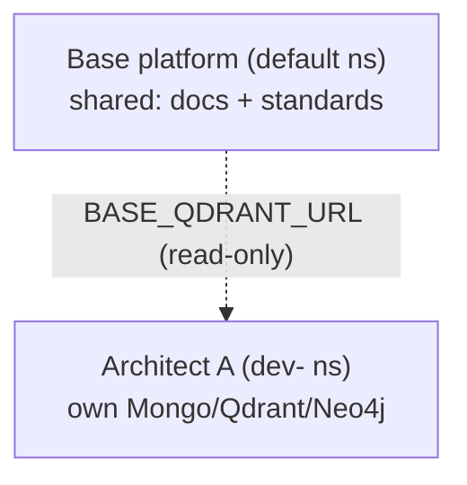

# Architect Brain Model (base knowledge + own brain)

> Status: stable · Last updated: 2026-08-29

## What it is

Each **Regno Architect** is a **complete new stack** — a k3s namespace with its **own brain**
(MongoDB + Qdrant + Neo4j) — plus a **read-only connection to the shared base knowledge**.

## Why

Brain-per-architect isolation: every architect has its own context, docs, and knowledge, and
learns independently — while still being able to draw on the shared base (docs + standards).

## How it works



- **Own brain** — `spawn-agent.mjs` applies `k8s/app.yaml` into the architect's namespace, so it
  gets its own databases (Mongo, Qdrant, Neo4j, Redis) with no shared state.
- **Base connection** — the spawner injects `BASE_QDRANT_URL=http://qdrant.default.svc.cluster.local:6333`
  into the architect's Secret (cross-namespace, read-only).
- **Search** — `POST /api/nexus/search` queries the architect's **own** Qdrant *and* the **base**
  Qdrant, merges, dedupes, and tags each result `source: 'own' | 'base'`.

## Files involved

- `scripts/spawn-agent.mjs` — injects `BASE_QDRANT_URL`
- `apps/web/src/routes/api/nexus/search/+server.ts` — own + base search
- `apps/web/src/routes/app/agents/+page.svelte` — "Regno Architects" admin screen
- `k8s/app.yaml` — the full stack per namespace

## Reproduce / verify

```bash
# spawn an architect, then check its search hits both stores:
WPOD=$(sudo kubectl get pods -l app=web -o jsonpath='{.items[0].metadata.name}')
sudo kubectl exec "$WPOD" -- node scripts/spawn-agent.mjs godemo 3300
# in the new namespace, POST /api/nexus/search → results tagged own|base
```
