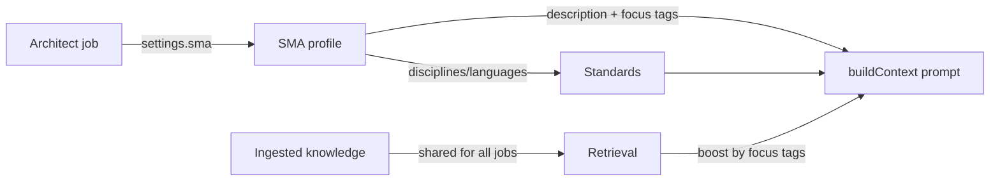

# SMA — Subject Matter Experts

> Status: stable · Last updated: 2026-08-30

## What it is

- **One architect per provisioned target.** If you want another architect, create it through
  the Mothership **Architects → New Architect** wizard.
- **SMA (Subject Matter Expert)** = a *selectable expert profile* you pick when running an
  architect job. It is **not** a new stack or namespace.
- An SMA is centered on a **focus area**: e.g. an *F1 Race Engineer* SMA centers its knowledge on
  **F1, telemetry, aerodynamics**.

## Knowledge & focus

- **All knowledge is shared** across every job. Ingesting a document makes it available to every
  architect job — nothing is hidden by default.
- Documents can carry **tags** (`ingestDocument` accepts `tags`). An SMA declares **focus tags**;
  when it runs a job, retrieval **boosts** documents whose tags match its focus tags (see
  `keywordSearch(query, limit, boostTags)` in `@regno/cortex`). Everything else stays reachable —
  focus tags only re-rank, they never filter.
- An SMA also has a **description** and optional **disciplines/languages**, which inject the
  matching best-practice standards (same mechanics as before).

## SMA vs persona

- **Persona** was the old name for a *developer flavour* profile (base standards + a developer's
  learned style). It is now the **`developer` field on an SMA** — a style overlay, nothing more.
- The architect job's selector is now the **SMA** selector (one profile = focus area + optional
  developer flavour + optional disciplines).

## Model



## Where it lives

- Admin UI: `apps/web/src/routes/app/agents/+page.svelte` (nav label "SMA").
- API: `apps/web/src/routes/api/agents/+server.ts` (GET list / POST create),
  `[slug]/+server.ts` (DELETE).
- Store: Mongo collection `agents` (`Collections.SMAS` in `@regno/shared`).
- Retrieval boost: `packages/cortex/src/search.ts` `keywordSearch(…, boostTags)`.
- Context injection: `packages/flow/src/context.ts` `loadSma()` + `buildContext(needs, { sma, prompt })`.
- Settings: `ExecutionSettings.sma` in `packages/flow/src/types.ts`.

## Reproduce / verify

```bash
# 1. Create an SMA (owner) via /app/agents — e.g. "F1 Race Engineer",
#    focus tags: F1, telemetry, aerodynamics.
# 2. In /app/chat, select the SMA and ask a question in that domain.
# 3. The execution emits a v2_sma event and the context includes a
#    "Focused knowledge (centered on: …)" block — the SMA lens applied.
```
