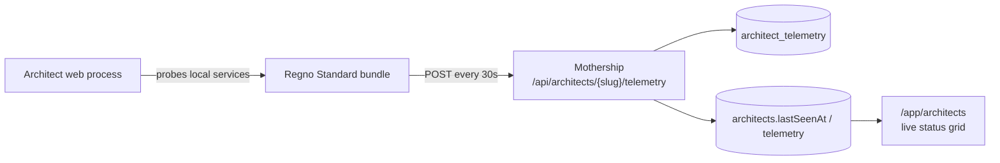

# Architect Telemetry (Regno Standard)

> Each provisioned Architect reports its health back to the Mothership as a
> **Regno Standard** document set, so the Architects page shows live status.

## Flow



- **Architect** — the full stack on its own machine. Its web container runs a
  heartbeat (`apps/web/src/lib/server/architect-telemetry.ts`, started from
  `hooks.server.ts`), probes Mongo/Redis/Qdrant/Neo4j, and POSTs a Regno Standard
  bundle to the Mothership.
- **Mothership** — stores the latest bundle in `architect_telemetry` and
  denormalizes a summary onto the `architects` record for fast listing.

## Configuration

| Env var | Set where | Purpose |
|---------|-----------|---------|
| `MOTHERSHIP_URL` | Mothership `.env.prod` | Public URL Architects report to. |
| `ARCHITECT_SLUG` | written to Architect `.env.prod` by the provisioner | Who this machine is. |
| `ARCHITECT_TELEMETRY_TOKEN` | minted once per Architect, stored in the vault, written to `.env.prod` | Machine auth (Bearer). |

The provisioner (`packages/provision/src/env.ts`) injects `MOTHERSHIP_URL`,
`ARCHITECT_SLUG`, and the token into the target's `.env.prod`; `docker-compose.yml`
passes them into the web container. The token is generated server-side in the
`PUT /api/architects/{slug}/secrets` handler and never echoed back.

## Auth

The ingest endpoint is **machine-authenticated**: `POST /api/architects/{slug}/telemetry`
requires `Authorization: Bearer <ARCHITECT_TELEMETRY_TOKEN>` (or `X-Architect-Token`),
compared timing-safe against the vault entry `architect:<slug>:env`. Admin reads use
the normal session auth.

## Regno Standard format

Each heartbeat is a full document set (see `docs/regno-standard/`):

| Document | Example id | Content |
|----------|-----------|---------|
| `ConfigDoc` | `cfg-architect-<slug>` | Root; `state: "Live"`, `sourceType: "Data"`. |
| `IdentityDoc` | `id-architect-<slug>` | Ownership (organization, data_owner). |
| `ParamDefDoc` | `param-def-<slug>-uptimeseconds` | Metric definitions (`ARCHITECT.System.UptimeSeconds`, …). |
| `ParamScalarValueDoc` | `scalar-<slug>-…-<nanos>` | Point-in-time values (uptime, mem %, service online 0/1). |
| `EventDefDoc` / `EventDataDoc` | `event-def-<slug>-status` / `event-…` | Overall health status event. |
| `TagDoc` | `tag-<slug>-version` | String metadata (version, domain, per-service state). |

Conventions honoured: nanosecond timestamps (serialized as decimal strings for
Int64 safety), camelCase fields, snake_case tag keys, dot-notation `sourceId`s,
and content-hash ids in `packages/shared/src/regno-standard.ts`.

Example metric:

```json
{
  "id": "param-def-john-uptimeseconds",
  "type": "ParamDefDoc",
  "sourceId": "ARCHITECT.System.UptimeSeconds",
  "name": "Uptime",
  "groups": ["Regno", "Architect", "Telemetry"],
  "units": "s",
  "format": "%.0f",
  "paramDefDocType": "Scalar"
}
```

## Storage

- `architect_telemetry` — one doc per Architect (`{ slug, configDocId, docs[], summary, receivedAt }`), replaced on every heartbeat.
- `architects` — denormalized `lastSeenAt`, `online`, `telemetry` summary for the list page.

`markStaleArchitectsOffline(maxAgeMs)` flips `online` to `false` for Architects
whose last heartbeat is older than the threshold (call it from a scheduler/CRON or
on list reads).
