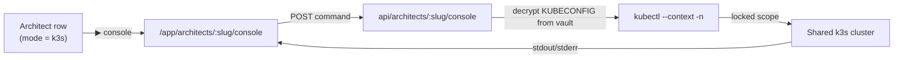

# Per-Architect Cluster Console

> A k9s-style, per-Architect **kubectl console** in the Mothership. Each Architect that
> runs in **k3s namespace mode** maps to a namespace on a shared cluster
> (e.g. `dev-<slug>` on `k3s-87`); the console locks every command into that
> Architect's context + namespace.
>
> Added 2026-09-07. Complements the (now Docker-Compose-first) Architect deploy
> model: k3s namespaces are viewed/managed here instead of via a shared k9s.

## Why

Architects used to be k3s namespaces managed with `kubectl`/`k9s` against a shared
kubeconfig. The Mothership is the control plane, so the cluster view belongs there —
scoped **per Architect**, using a **per-Architect kubeconfig** stored in the encrypted
credentials vault (`architect:<slug>:env` → `KUBECONFIG`). The kubeconfig never leaves
the server and never ships to the Architect box.



## Enabling it for an Architect

1. Open the **Architect wizard** → Step 2 → set **Deploy mode = k3s namespace**.
2. Fill the three new fields:
   - **Cluster context** — the kubeconfig context name for the shared cluster (e.g. `k3s-87`).
   - **Namespace** — this Architect's namespace (e.g. `dev-john`).
   - **Kubeconfig (YAML)** — pasted, encrypted in the vault, used only by the Mothership.
3. Save & launch (or just save for an existing k3s Architect via the edit flow).

> These map to `target.cluster` / `target.namespace` on the Architect doc and the
> `KUBECONFIG` secret in `architect:<slug>:env`.

## Using the console

From **System → Architects**, click the ▶ (console) icon on a k3s-mode Architect row
(or **Cluster console** in the details modal). The console:

- auto-runs `kubectl get pods -n <ns>` on connect,
- lets you type kubectl verbs freehand (↑/↓ recalls history),
- shows quick shortcuts: `get pods`, `get deployments`, `top pods`, `logs <pod>`, etc.,
- has a **Follow logs** row — type a pod name (optionally a container) and hit **Follow logs**
  to stream `kubectl logs -f --tail 200` live into the terminal over SSE (`?stream=logs`),
  then **Stop** to kill the stream (it also ends when the pod's log stream closes).
- has a **Workloads** button → a structured, clickable inventory of the Architect's namespace
  (`GET ?view=workloads` returns `kubectl get … -o json` collapsed to tables):
  - **Pods** — ready/phase/restarts/age; click **▶ logs** to live-follow that pod,
    **describe** to describe it, or **✕** (with confirm) to delete it.
  - **Deployments / StatefulSets** — ready/desired/available; **restart** does a confirm-gated
    `rollout restart`.
  - **Services** — type / ClusterIP / ports. Refresh re-queries the namespace.

## Scope + safety

Everything the console runs is locked to the Architect's namespace:

| Rule | Detail |
|---|---|
| Verbs allowed | `get, describe, top, logs, rollout, delete, explain, api-resources, version, auth, config` |
| `delete` | pods only, must name a pod |
| `rollout` | `restart \| status \| history` only |
| Blocked flags | caller may not pass `--kubeconfig/--context/-n/--namespace/--all-namespaces/--as/--user/--server/--token/…` |
| Cluster-scoped resources | `nodes`, `pv`, `sc`, `namespaces`, `clusterroles`, … run **without** `-n` (still context-locked) |
| Never allowed | `exec, apply, edit, scale, cp, port-forward, proxy, attach, create, replace, run, set, …` |
| Logs | bounded with `--tail=200` by default so a noisy pod can't flood the console |

Each command runs with a 45s timeout against a throwaway `0600` kubeconfig written to a
temp dir and removed immediately after.

## File map

```
apps/mothership/src/routes/api/architects/[slug]/console/+server.ts   GET status · GET ?view=workloads · POST run · GET ?stream=logs (SSE live tail)
apps/mothership/src/routes/app/architects/[slug]/console/+page.svelte terminal UI
apps/mothership/src/lib/architects/ArchitectWizard.svelte             k3s fields (context/ns/KUBECONFIG)
apps/mothership/src/routes/api/architects/[slug]/+server.ts           PUT target carries cluster/namespace
apps/mothership/Dockerfile                                            installs kubectl v1.30.2
packages/db/src/architects.ts                                         ArchitectTarget.cluster/.namespace
packages/provision/src/env.ts                                         KUBECONFIG is provisioner-only (never in .env.prod)
```

## Known limits (future work)

- The Workloads list is a point-in-time snapshot — no auto-refresh loop or live `top` yet.
- Requires the Mothership image to be rebuilt (kubectl added) and a redeploy.
- Streaming is `logs -f` only (SSE, one stream per tab).
