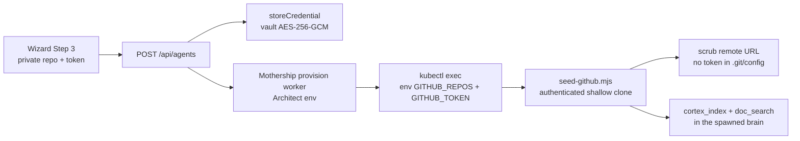

# Private GitHub Repo Seeding

How to make Regno ingest **private** GitHub repos as "repos to learn from" for an Architect
(agent). Covers both the wizard path and the org-wide seed script.

## Why this is needed

`scripts/seed-github.mjs` clones repos with plain `git clone --depth 1`. Private repos require
authentication, so without a GitHub PAT the clone fails and the repo is skipped (the script logs
`skip (clone failed — private or no access?)`).

## Token sources (in priority order)

1. **Per-agent token (wizard)** — entered on Step 3 of the Architect wizard
   (`/app/agents`), stored AES-256-GCM encrypted in the credentials vault
   (`credentials` collection, name `<slug>-github-token`) and forwarded to the spawned
   namespace only for that agent's seeding.
2. **Global `GITHUB_TOKEN` (env)** — set in `.env.prod`, becomes the `regno-env` k8s Secret,
   and is inherited by every spawned namespace. Used when no per-agent token is given.

The clone token is embedded in the clone URL only for the duration of the clone and is then
scrubbed (`git remote set-url origin <clean-url>`), so the token never persists in the cloned
`.git/config` on disk.

## Creating a token

- **Fine-grained PAT** (recommended): GitHub → Settings → Developer settings → Personal access
  tokens → Fine-grained tokens. Grant **Repository access** to the private repos/org and
  **Contents: Read-only** (and Metadata read, which is auto-granted).
- **Classic PAT**: needs the `repo` scope for private repo access.

## Wizard path (per-agent)

1. Open **Regno Architects** (`/app/agents`) → **Create new Architect**.
2. Fill Steps 1–2, then on **Step 3 · Repos** paste the private repos, one per line
   (`owner/repo`).
3. Paste the PAT into **GitHub token (optional — needed for private repos)**.
4. Click **Test token** — it validates the token and checks read access to each repo you listed
   (the response shows "Read access to all N repo(s)" or the repos you can't access).
5. Continue to Step 4 (optional datasource) and **Create agent**. The token is stored encrypted
   in the vault and used only for that agent's repo seeding.

## Global path (org-wide seed)

Set `GITHUB_TOKEN` in `.env.prod`:

```env
GITHUB_ORG=your-org
GITHUB_TOKEN=github_pat_...
```

Then either redeploy (the `regno-env` Secret is regenerated) or run the seed directly:

```bash
npm run db:seed-github          # lists + clones all org repos (private included)
```

For an explicit list without org listing:

```bash
GITHUB_REPOS=owner/repo-a,owner/repo-b GITHUB_TOKEN=... node scripts/seed-github.mjs
```

## How it works end-to-end



## Security notes

- The token is encrypted at rest (credentials vault) and forwarded via **env**, never argv, so
  it doesn't show up in `ps`.
- It appears briefly in the `kubectl exec … env GITHUB_TOKEN=…` command string inside the
  spawned pod (visible to that pod's processes). Acceptable for admin-only internal tooling.
- After cloning, the remote URL is reset to the clean `https://github.com/<owner>/<repo>.git`.

## Troubleshooting

| Symptom | Fix |
| --- | --- |
| "Invalid token — GitHub returned 401" | PAT is wrong/revoked; create a new one. |
| "No access to: owner/repo" | Token lacks Contents read (fine-grained) or `repo` scope (classic), or the repo isn't under the token's granted access. |
| Repo skipped in logs | Clone failed — check the token is inherited (global `GITHUB_TOKEN` in `regno-env`) or set a per-agent token. |
